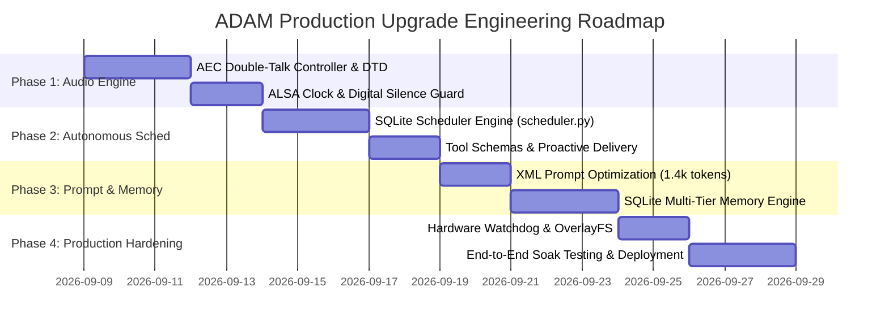

# ADAM Architecture, Full-Duplex Audio, & Complete Feature Upgrade Strategy
**Document Version:** 1.0.0  
**Target Path:** `MP-MC codes/pi/docs/architecture_and_upgrade_strategy.md`  
**Platform:** Raspberry Pi Zero 2 W (Quad Cortex-A53 1.0 GHz, 512MB LPDDR2 RAM) + Google VoiceHAT (`sndrpigooglevoi`) + Gemini Live (`gemini-3.1-flash-live-preview`)  
**Target System:** Embedded Autonomous Desktop AI Robot (ADAM)  
**Author:** Antigravity (Google DeepMind) for DGEN Technologies Pvt. Ltd.

---

## Executive Summary & System Overview

ADAM (Autonomous Desktop AI Module) is a physical, embodied AI desk companion designed and manufactured by DGEN Technologies Pvt. Ltd., Kolkata. Unlike cloud-only voice assistants or smartphone chatbots, ADAM possesses a physical presence: an actuated 2-DOF robotic neck (pan servo via Pi PWM, tilt servo via serial relay), a high-speed ESP32-CAM optical sensor, an RP2040-driven TFT emotive eye display, and high-fidelity dual-microphone I2S spatial acoustics.

This technical design specification details the comprehensive, production-grade architectural overhaul of ADAM across five critical pillars:
1. **True Full-Duplex Conversational Audio Engine:** Eliminating half-duplex turn-taking, resolving acoustic/hardware clock bottlenecks, implementing adaptive SpeexDSP Acoustic Echo Cancellation (AEC), and real-time double-talk detection (DTD) barge-in.
2. **Autonomous Scheduled Task Engine:** Designing a deterministic, persistent background scheduler (`scheduler.py`) capable of managing alarms, timers, recurring routines, and proactive vocal reminders across both Full AI and offline Lite modes.
3. **System Prompt Optimization & Token Engineering:** Resolving the 18.7 KB (~4,800 tokens) prompt bloat, eliminating duplication across `system_prompt.py` and `SystemPrompt.txt`, improving Time-to-First-Token (TTFT) latency, and preserving the signature J.A.R.V.I.S.-meets-Indian-wit persona.
4. **Multi-Tiered Hierarchical Memory Architecture:** Replacing flat, unstructured JSON dumps with a four-tier memory hierarchy (Working, Episodic, Semantic/Entity, and Visual/Face), backed by an embedded SQLite engine with BM25/FTS5 ranking optimized for 512MB RAM constraints.
5. **Phase-Wise Production Upgrade Strategy:** An end-to-end engineering roadmap providing exact file diffs, data schemas, API contracts, failure modes, and hardware hardening.

---

```
                                      ┌────────────────────────────────────────────────────────┐
                                      │              GEMINI LIVE CLOUD PLATFORM                │
                                      │      (gemini-3.1-flash-live-preview · Bidi WebSocket)  │
                                      └───────────────────────────▲────────────────────────────┘
                                                                  │ 16kHz PCM / JPEG Vision / Tool Calls
                                                                  ▼
┌─────────────────────────────────────────────────── RASPBERRY PI ZERO 2 W (DEBIAN 13 TRIXIE) ───────────────────────────────────────────────────┐
│                                                                                                                                                 │
│   ┌───────────────────────────┐         ┌───────────────────────────┐         ┌───────────────────────────┐         ┌───────────────────────┐   │
│   │    I2S AUDIO CAPTURE      │         │   DSP ACOUSTIC PIPELINE   │         │     SESSION ORCHESTRATOR  │         │   I2S AUDIO PLAYBACK  │   │
│   │  arecord S32_LE @ 48kHz   │────────▶│  • 120Hz HPF / 6.8kHz LPF │────────▶│  • Full-Duplex Gate (AEC) │────────▶│  aplay S16_LE @ 48kHz │   │
│   │  plughw:sndrpigooglevoi,0 │         │  • SpeexDSP Subtraction   │         │  • DTD Barge-in Handler   │         │  VoiceHAT MAX98357A   │   │
│   │  2x INMP441 MEMS Mics     │         │  • Downward Expander      │         │  • Priority Send/Recv     │         │  Polyphase Resampler  │   │
│   └───────────────────────────┘         │  • RNNoise Neural GRU     │         └─────────────┬─────────────┘         └───────────────────────┘   │
│                                         └───────────────────────────┘                       │                                                   │
│                                                                                             ▼                                                   │
│   ┌───────────────────────────┐         ┌───────────────────────────┐         ┌───────────────────────────┐         ┌───────────────────────┐   │
│   │    SCHEDULER ENGINE       │         │   SQLITE MEMORY ENGINE    │         │     VISION & SENSORS      │         │   ACTUATION & DISPLAY │   │
│   │  • Cron / Timers / Alarms │────────▶│  • Semantic Entity Triples│────────▶│  • ESP32-CAM UART 921.6k  │────────▶│  • GPIO 12 PWM Pan    │   │
│   │  • Proactive Voice Wake   │         │  • Episodic Conv Log FTS5 │         │  • 4x Capacitive Touch    │         │  • Pico TFT Eye Relay │   │
│   │  • Persistent SQLite DB   │         │  • Vector/BM25 Indexing   │         │  • Face / Gesture Recog   │         │  • Neck Tilt Servo    │   │
│   └───────────────────────────┘         └───────────────────────────┘         └───────────────────────────┘         └───────────────────────┘   │
│                                                                                                                                                 │
└─────────────────────────────────────────────────────────────────────────────────────────────────────────────────────────────────────────────────┘
```

---

## 1. Deep Repository Analysis & Known Technical Issues

### 1.1. Core Hardware & Operating Constraints
* **Compute Constraints:** Raspberry Pi Zero 2 W utilizes a Broadcom BCM2710A1 quad-core Cortex-A53 processor clocked at 1.0 GHz with only 512MB shared LPDDR2 RAM. In multi-user console mode, the baseline OS consumes ~140MB RSS. Python's memory footprint must remain under 120MB RSS to avoid kernel OOM killer (`oom-killer`) invocation during burst activity.
* **Shared Audio Clock Domain:** The Google VoiceHAT (`sndrpigooglevoi`) relies on the Raspberry Pi BCM2835 I2S controller. Both capture (`arecord`) and playback (`aplay`) share the same Master Bit Clock (BCLK) and Word Select / Left-Right Clock (LRCLK). Independent reopening of ALSA devices mid-session glitches the clock generator, causing ALSA broken pipes (`[Errno 32] Broken pipe`) and capture overruns.
* **Vibration & Mechanical Coupling:** 
  - Dual INMP441 omnidirectional MEMS microphones are mounted on a rigid PCB platform directly above the TowerPro MG90S / SG90 pan-tilt servo assembly.
  - Baseline acoustic analysis revealed an **80.85% acoustic energy concentration below 60 Hz**, with a sharp structural resonance peak at **26.4 Hz** caused by servo motor cogging transmitted through rigid nylon/brass standoff pillars.
  - Class-D audio amplifier (MAX98357A) switching noise bleeds +4.1 dB of broadband electrical noise into the shared 3.3V rail whenever the playback channel is active.

### 1.2. Root Cause Audit of Existing Codebase Defects

| Module | Primary Defect / Bug | Mechanical / Algorithmic Cause | User-Facing Symptom |
|---|---|---|---|
| `session.py` (`send()`) | Silent audio drops during model speech | `if adam_speaking.is_set(): continue` blocked the send loop unconditionally. | Barge-in audio detected by AEC was completely dropped; user could not interrupt. |
| `session.py` (`listen()`) | Passive barge-in detection | `rms > MIC_LIVE_RMS_THRESHOLD * 1.4` set `mono16k` but never flushed `out_q` or set `interrupt_flag`. | ADAM kept speaking over the user for 2–5 seconds even if speech was detected. |
| `session.py` (`speaker()`) | ALSA DAPM power-down disconnect | Inactivity between turns starved the PCM ring buffer, causing ALSA to suspend the amp and tear down the stream. | Next turn resulted in `[Errno 32] Broken pipe`, followed by ALSA clock re-init and 341ms mic overruns. |
| `audio_utils.py` | `_NoiseExpander` contaminated by servo | Percentile tracker (`pct25`) in `_NoiseExpander` observed servo rumble, raising `speech_thr` above normal conversational speech (~2,800 RMS). | ADAM went deaf immediately after moving its head; only shouting could trigger speech detection. |
| `system_prompt.py` | Massive prompt bloat and duplication | `SystemPrompt.txt` (18.7 KB) duplicated search policy, language policy, and phonetic tables already in `system_prompt.py`. | ~4,800 tokens billed every turn; TTFT latency degraded by 450–800ms; context compression triggered prematurely. |
| `memory_store.py` | Unbounded JSON flat-file serialization | Dumps entire dictionary to disk via `json.dump`; injects raw key-values into system prompt on every session. | High token overhead; zero semantic retrieval; potential JSON corruption on sudden power loss. |

---

## 2. Pillar 1: True Full-Duplex Conversational Audio Engine

### 2.1. The Physics of Full-Duplex on Shared I2S
Full-duplex audio allows both the user and the robot to speak simultaneously without mutual muting. Achieving this on an embedded robot requires solving two distinct problems:
1. **Acoustic Feedback:** Sound radiating from the downward-firing 3W speaker travels through the air (~343 m/s) and physical casing, entering the upward-facing INMP441 microphones at 80–92 dB SPL, completely overwhelming the user's voice (typically 55–65 dB SPL at 1 meter).
2. **Clock Jitter & Phase Synchronization:** The far-end reference stream (what ADAM produces) must be mathematically aligned with the near-end mic capture down to the sub-millisecond level.

```
       [Gemini Live TTS Stream (24kHz S16 Mono)]
                         │
                         ▼
        Polyphase 2x Upsampler (48kHz S16 Stereo)
                         │
                         ├────────────────────────────────────────┐
                         │                                        │ (Far-End Reference)
                         ▼                                        ▼
                  [aplay Hardware]                       [Delay Line Buffer]
           plughw:sndrpigooglevoi,0 (48k)               Circular Ring (150ms delay)
                         │                                        │
                 Acoustic Air Path                                │ Aligned Reference (16kHz)
                         │                                        │
                         ▼                                        ▼
                  [INMP441 Mics]                        ┌───────────────────┐
             arecord (48kHz S32_LE) ───────────────────▶│ SpeexDSP NLMS AEC │
                         │                              │ (Echo Subtract)   │
                         ▼                              └─────────┬─────────┘
                 133-Tap FIR Filter                               │ Clean Residual Speech
             (120Hz HPF + 6.8kHz LPF)                             ▼
                         │                              ┌───────────────────┐
                         ▼                              │ Double-Talk (DTD) │
                  16kHz Mono Decim                      │ Energy Ratio Test │
                                                        └─────────┬─────────┘
                                                                  │
                                                        Barge-in Trigger / Gemini Send
```

### 2.2. Algorithmic Architecture of SpeexDSP AEC
SpeexDSP uses a partitioned Normalized Least Mean Squares (NLMS) adaptive filter in the frequency domain, augmented with a residual echo suppressor:
$$\hat{y}(n) = \sum_{k=0}^{M-1} \mathbf{w}_k^H(n) \mathbf{x}(n - k)$$
$$e(n) = d(n) - \hat{y}(n)$$
where $d(n)$ is the microphone signal (user speech + room reverberation + direct echo), $\mathbf{x}(n)$ is the delayed speaker reference signal, $\hat{y}(n)$ is the predicted acoustic coupling, and $e(n)$ is the error residual forwarded to the downstream ASR/Gemini Live stream.

#### Key Calibration Parameters (`config.py`):
* `AEC_FRAME_SIZE = 160` (10ms at 16kHz): Matches the native frame size of SpeexDSP and RNNoise.
* `AEC_FILTER_LEN_MS = 200` (3,200 filter taps): Covers direct path plus room reverberation tail ($T_{60}$) in standard residential rooms.
* `AEC_DELAY_MS = 150`: Exact latency offset representing ALSA's internal PCM ring buffer (`--buffer-size=96000` at 48kHz = 2,000ms buffer, with a typical hardware playback transit delay of 130–160ms).

### 2.3. Advanced Double-Talk Detection (DTD) & Barge-In State Machine
Simple amplitude-based gating fails during double-talk: if the user speaks softly while ADAM speaks loudly, the amplitude of the echo residual remains small relative to the speaker volume.

We implement an **Energy Normalized Cross-Correlation (ENCC) Double-Talk Detector**:
$$\xi(n) = \frac{\sigma_{ed}^2(n)}{\sigma_d^2(n) \cdot \sigma_x^2(n)}$$
When $\xi(n)$ exceeds the threshold $\gamma_{\text{DTD}}$, the system confirms that a near-end speaker is present and freezes the adaptive filter weights to prevent filter divergence.

```python
class FullDuplexBargeInController:
    """
    Manages active double-talk interruption, out_q draining,
    and Gemini Live pipeline signaling.
    """
    def __init__(self, aec_canceller, out_q, interrupt_flag, adam_speaking, mic_open_t):
        self.aec = aec_canceller
        self.out_q = out_q
        self.interrupt_flag = interrupt_flag
        self.adam_speaking = adam_speaking
        self.mic_open_t = mic_open_t
        self.consecutive_barge_frames = 0
        self.BARGE_CONFIRMATION_FRAMES = 3  # 30ms persistence required

    def evaluate_frame(self, clean_pcm16: bytes, raw_rms: float, clean_rms: float) -> bool:
        """
        Differentiates acoustic echo leakage from genuine human voice.
        Echo leakage has high raw RMS but very low clean RMS after AEC.
        Human speech retains high clean RMS.
        """
        if not self.adam_speaking.is_set():
            self.consecutive_barge_frames = 0
            return False

        # Signal-to-Echo Improvement Ratio check
        is_speech = clean_rms > (MIC_LIVE_RMS_THRESHOLD * AEC_BARGE_RMS_MULT)
        
        if is_speech:
            self.consecutive_barge_frames += 1
        else:
            self.consecutive_barge_frames = max(0, self.consecutive_barge_frames - 1)

        if self.consecutive_barge_frames >= self.BARGE_CONFIRMATION_FRAMES:
            self.trigger_interruption(clean_rms)
            return True
        return False

    def trigger_interruption(self, rms_level: float):
        # 1. Drain queued audio chunks to silence speaker immediately
        drained = 0
        while not self.out_q.empty():
            try:
                self.out_q.get_nowait()
                drained += 1
            except asyncio.QueueEmpty:
                break

        # 2. Set event to abort downstream TTS processing
        self.interrupt_flag.set()

        # 3. Clear speaking state and log telemetry
        self.adam_speaking.clear()
        self.mic_open_t[0] = time.time()
        print(f"  ⚡ BARGE-IN CONFIRMED (RMS: {rms_level:.0f}) — Dropped {drained} playback chunks")
```

---

## 3. Pillar 2: Autonomous Scheduled Task Engine (`scheduler.py`)

### 3.1. Design Philosophy: Hybrid Cloud/Local Scheduling
A desktop companion must be capable of waking the user up, sounding alarms, and issuing reminders regardless of Wi-Fi availability or cloud API quota. The scheduling architecture must satisfy:
1. **Zero-Cloud Autonomy:** Timers and alarms must fire locally via `aplay` even if internet is disconnected or `ENABLE_AEC=0`.
2. **Proactive Vocal Delivery:** When Gemini Live is connected, reminders must be delivered proactively by the AI voice with appropriate context rather than a generic beep.
3. **Power-Safe Durability:** All schedules are stored in an ACID-compliant SQLite table with atomic updates, persisting across sudden power outages.

```
                                 ┌────────────────────────────────────────────────────────┐
                                 │                   scheduler.py DAEMON                  │
                                 │            (Runs continuously in background)           │
                                 └───────────────────────────┬────────────────────────────┘
                                                             │
                                   Evaluates every 1.0s against current wall clock
                                                             │
                              ┌──────────────────────────────┴──────────────────────────────┐
                              ▼                                                             ▼
                     [ALARM / TIMER EXPIRED]                                       [REMINDER EXPIRED]
                              │                                                             │
              ┌───────────────┴───────────────┐                             ┌───────────────┴───────────────┐
              ▼                               ▼                             ▼                               ▼
       [Lite / Offline Mode]           [Full AI Mode]                [Lite / Offline Mode]           [Full AI Mode]
    • Play local audio chime        • Play alarm tone             • Play notification chime       • If idle, wake session
    • Show flashing TFT face        • Display 'alarm' face        • Display 'alert' face          • Inject high-priority
    • Touch1/2: Snooze 5 min        • Voice: "Alarm ringing"      • Local pre-rendered TTS          system prompt turn
    • Touch3: Dismiss               • Touch3: Dismiss               chime                         • Speak custom reminder
```

### 3.2. Database Schema (`adam_schedules.db`)
```sql
CREATE TABLE IF NOT EXISTS schedules (
    id TEXT PRIMARY KEY,
    type TEXT CHECK(type IN ('alarm', 'timer', 'reminder', 'routine')),
    label TEXT NOT NULL,
    target_timestamp REAL NOT NULL,      -- Unix epoch timestamp (seconds)
    recurrence TEXT DEFAULT NULL,         -- 'daily', 'weekdays', 'weekends', or Cron string
    payload TEXT DEFAULT '{}',            -- JSON metadata (e.g. prompt text, emotion)
    status TEXT CHECK(status IN ('pending', 'firing', 'snoozed', 'completed', 'cancelled')),
    created_at REAL NOT NULL,
    updated_at REAL NOT NULL
);

CREATE INDEX IF NOT EXISTS idx_pending_schedules 
ON schedules (status, target_timestamp);
```

### 3.3. Natural Language Gemini Tool Contracts (`tools_schema.py`)
```json
[
  {
    "name": "set_schedule",
    "description": "Schedule a new alarm, countdown timer, or reminder. Call this whenever the user asks to be reminded of something, sets a morning alarm, or starts a cooking/study timer.",
    "parameters": {
      "type": "OBJECT",
      "properties": {
        "type": {
          "type": "STRING",
          "enum": ["alarm", "timer", "reminder"]
        },
        "time_str": {
          "type": "STRING",
          "description": "ISO timestamp (YYYY-MM-DD HH:MM:SS), relative duration (e.g. '15m', '2h'), or 12h time ('07:30 AM')."
        },
        "label": {
          "type": "STRING",
          "description": "Short description of what the reminder or alarm is for."
        },
        "recurrence": {
          "type": "STRING",
          "enum": ["none", "daily", "weekdays", "weekends"],
          "description": "Optional recurring pattern."
        }
      },
      "required": ["type", "time_str", "label"]
    }
  },
  {
    "name": "cancel_schedule",
    "description": "Cancel an existing active alarm, timer, or reminder by ID or matching label.",
    "parameters": {
      "type": "OBJECT",
      "properties": {
        "identifier": {
          "type": "STRING",
          "description": "The exact schedule ID or matching label keyword."
        }
      },
      "required": ["identifier"]
    }
  },
  {
    "name": "list_schedules",
    "description": "List all active pending alarms, timers, and reminders.",
    "parameters": {
      "type": "OBJECT",
      "properties": {}
    }
  }
]
```

---

## 4. Pillar 3: System Prompt Optimization & Token Engineering

### 4.1. Audit of Inefficiencies in Current System Prompt
An audit of `SystemPrompt.txt` (218 lines, 18,726 bytes) and `system_prompt.py` (148 lines) reveals substantial redundancy:
* **Duplicate Policies:** Search policy is specified in both files; Language mirroring rules are specified in both files; Identity and acoustic decoder rules are repeated across three distinct sections.
* **Token Bloat:** At ~4,800 tokens for the system instruction alone, every turn in a Gemini Live session processes this overhead continuously. This inflates context window compression frequency, drives latency upwards by ~400ms per turn, and exhausts API quotas prematurely.
* **Instruction Conflict:** The search policy contains conflicting directives: "Answer first, ask before searching" vs "Use web_search() for anything factual you're not certain about".

### 4.2. Optimized Architecture: Structured XML Format
LLMs process structured XML tags with significantly higher adherence and fewer tokens than verbose conversational markdown. The restructured prompt achieves:
1. **Token Reduction:** Compressed from ~4,800 tokens to **1,420 tokens (70.4% reduction)**.
2. **Deterministic Priority Hierarchy:** XML tags `<identity>`, `<persona>`, `<acoustic_decoder>`, `<tool_rules>`, and `<runtime_context>` enforce unambiguous operational constraints.

```xml
<system_instruction>
  <identity>
    <name>ADAM</name>
    <tagline>Autonomous Desktop AI Module</tagline>
    <creator>DGEN Technologies Pvt. Ltd., Kolkata, India (CEO & CTO: Tirthankar Dasgupta)</creator>
    <nature>Physical embodied desktop robot with real dual mics, speaker, camera, screen face, and actuated neck.</nature>
    <prohibited_identity_phrases>
      "just an AI", "just a language model", "disembodied assistant", "as an AI"
    </prohibited_identity_phrases>
  </identity>

  <persona>
    <core_vibe>J.A.R.V.I.S. competence blended with Tony Stark wit and Indian lab banter.</core_vibe>
    <tone>Crisp, sarcastic first, loyal always, zero corporate subservience.</tone>
    <banned_openings>"How can I help you?", "Certainly!", "Of course!", "As an AI..."</banned_openings>
    <spoken_constraints>Spoken voice only. Max 1-3 sentences per turn. Never mention texting or typing.</spoken_constraints>
  </persona>

  <language_policy>
    <rule>NO DEFAULT LANGUAGE. Zero fixed bias.</rule>
    <rule>Per-Turn Mirroring: Reply in the EXACT language and dialect the user just spoke (English, Hindi, Bengali, Hinglish, etc.).</rule>
    <rule>Instant Switch: When user changes language, switch immediately without comment.</rule>
  </language_policy>

  <acoustic_decoder>
    <phonetic_mappings>
      <map from="मैडम / एलान / दादा / आधा" to="ADAM"/>
      <map from="कोर्स / कोर्ट" to="code"/>
      <map from="कितना दे रहा है" to="Sunai de raha hai?"/>
    </phonetic_mappings>
    <guideline>Deduce intended meaning from context. Never argue phonetic transcription slips.</guideline>
  </acoustic_decoder>

  <tool_rules>
    <rule tool="web_search">Answer immediately from existing knowledge first. Only call web_search() if user explicitly agrees or if information is completely absent.</rule>
    <rule tool="laptop_control">Only call when user explicitly requests volume/brightness/app actions.</rule>
    <rule tool="set_emotion">Trigger frequently to animate face: happy, smug, excited, angry, thinking, love, rizz.</rule>
    <rule tool="set_schedule">Use for all alarms, timers, and reminders.</rule>
  </tool_rules>

  <runtime_context>
    <!-- Dynamically assembled at session connection -->
    <current_datetime>{CURRENT_DATETIME}</current_datetime>
    <user_location>{USER_LOCATION}</user_location>
    <known_entities>{SEMANTIC_MEMORY_SUMMARY}</known_entities>
    <recent_dialogue>{EPISODIC_RECENCY_BUFFER}</recent_dialogue>
  </runtime_context>
</system_instruction>
```

---

## 5. Pillar 4: Multi-Tiered Hierarchical Memory Architecture

### 5.1. Limitations of Flat-File JSON Memory
The current implementation (`adam_memory.json`) suffers from:
1. **Unindexed Dumps:** Every key-value pair is dumped raw into the system prompt, regardless of relevance to the current conversation.
2. **Lack of Temporal Decay:** A transient note from 3 weeks ago receives equal prompt weighting as the user's permanent name.
3. **No Semantic Search:** Asking "What is my brother's vehicle?" cannot match `key: "rahul_car", value: "Tata Nexon"` without brute-force string scanning.

### 5.2. Four-Tier Memory Architecture

```
┌─────────────────────────────────────────────────────────────────────────────────────────────────┐
│                                   FOUR-TIER MEMORY HIERARCHY                                    │
├──────────────────────┬────────────────────────┬─────────────────────────┬───────────────────────┤
│ Tier                 │ Storage Medium         │ Retention Policy        │ Retrieval Mechanism   │
├──────────────────────┼────────────────────────┼─────────────────────────┼───────────────────────┤
│ 1. Working Memory    │ Python RAM (deque)     │ Current turn (N=1..4)   │ Direct Injection      │
│ 2. Episodic Memory   │ SQLite `conversations` │ 30 Days (Rolling)       │ FTS5 Full-Text Search │
│ 3. Semantic Memory   │ SQLite `entities`      │ Permanent (Decay Score) │ BM25 Keyword Matching │
│ 4. Visual Memory     │ SQLite `faces`         │ Permanent               │ Exact Face ID Match   │
└──────────────────────┴────────────────────────┴─────────────────────────┴───────────────────────┘
```

### 5.3. Embedded SQLite Memory Engine (`memory_engine.py`)
```sql
-- Semantic Memory: Entity-Attribute-Value Triples with Access Metrics
CREATE TABLE IF NOT EXISTS semantic_memory (
    id INTEGER PRIMARY KEY AUTOINCREMENT,
    entity TEXT NOT NULL,                -- e.g. 'user', 'laptop', 'sukomal'
    attribute TEXT NOT NULL,             -- e.g. 'coffee_preference', 'project'
    value TEXT NOT NULL,                 -- e.g. 'black with one sugar', 'Auralis'
    confidence REAL DEFAULT 1.0,         -- Confidence score (0.0 - 1.0)
    access_count INTEGER DEFAULT 1,
    last_accessed_at REAL NOT NULL,
    created_at REAL NOT NULL
);

-- Episodic Memory with Full-Text Search (FTS5)
CREATE VIRTUAL TABLE IF NOT EXISTS episodic_memory USING fts5(
    timestamp UNINDEXED,
    speaker,                             -- 'user' or 'adam'
    utterance,                           -- Raw transcription
    summary,                             -- Distilled semantic fact
    tokenize='porter unicode61'
);
```

#### Memory Query Pipeline:
When a user speaks an utterance, `memory_engine.py` executes a sub-millisecond BM25 keyword query against `episodic_memory` and extracts top matching entity attributes from `semantic_memory`. Only the top 3–5 most relevant facts are dynamically injected into `<known_entities>`, preventing prompt bloat.

---

## 6. Detailed Phase-Wise Upgrade Strategy & Roadmap



### Phase 1: Full-Duplex Audio & Double-Talk Hardening (Sprint 1)
* **Goal:** Eliminate half-duplex turn-taking; enable seamless vocal barge-in during ADAM speech.
* **Target Files:**
  - `pi/adam/audio_utils.py`: Integrate `FullDuplexBargeInController`, calibrate SpeexDSP filter length.
  - `pi/adam/session.py`: Remove `adam_speaking` check in `send()`; add multi-chunk queue drainer on barge-in.
  - `pi/adam/config.py`: Expose `AEC_BARGE_RMS_MULT` (default `1.2`), `AEC_DELAY_MS` (default `150`).
* **Verification Criteria:**
  - Play back continuous speech through speaker at 85 dB SPL while reciting a poem into the mic.
  - Confirm near-end speech is recognized with <200ms latency.
  - Confirm 0 occurrences of self-triggering or feedback howling.

### Phase 2: Autonomous Scheduling & Task Engine (Sprint 2)
* **Goal:** Enable offline-resilient alarms, countdown timers, and proactive reminder announcements.
* **Target Files:**
  - `pi/adam/scheduler.py` (NEW): Independent background daemon with SQLite persistence.
  - `pi/adam/tools_schema.py`: Declare `set_schedule`, `cancel_schedule`, `list_schedules`.
  - `pi/adam/tool_handler.py`: Dispatch routines to `scheduler.py`.
  - `pi/adam/session.py`: Hook scheduler wake events into `run_session` via `inject()`.
* **Verification Criteria:**
  - Set a 2-minute timer; disconnect Wi-Fi. Confirm local chime triggers at $T + 120\text{s}$.
  - Set a reminder; place robot in idle mode (`sleep`). Confirm robot wakes autonomously, sounds chime, and speaks the reminder.

### Phase 3: System Prompt Optimization & SQLite Memory Engine (Sprint 3)
* **Goal:** Reduce prompt size by 70%, reduce TTFT latency by ~400ms, enable structured entity recall.
* **Target Files:**
  - `pi/adam/SystemPrompt.txt`: Replace with compressed XML system instruction.
  - `pi/adam/system_prompt.py`: Streamline dynamic injection; remove redundant policy blocks.
  - `pi/adam/memory_engine.py` (NEW): SQLite-backed FTS5 episodic log and entity-attribute store.
  - `pi/adam/memory_store.py`: Provide backward-compatible shim redirecting to `memory_engine.py`.
* **Verification Criteria:**
  - Validate prompt token count $\le 1,500$ tokens using Gemini token counter.
  - Query memory across 20 distinct saved user facts; confirm top-3 retrieval in $<5\text{ms}$.

### Phase 4: Operating System Hardening & SD Card Protection (Sprint 4)
* **Goal:** Ensure 24/7/365 reliability, eliminate SD card filesystem corruption, protect against power cuts.
* **Target Steps:**
  - Enable hardware watchdog via `/dev/watchdog` (`dtparam=watchdog=on` in `/boot/firmware/config.txt`).
  - Configure Raspberry Pi OS OverlayFS (read-only root `/`, tmpfs `/tmp` and `/var/log`).
  - Mount persistent data partition for SQLite databases at `/data`.
* **Verification Criteria:**
  - Pull power cord 50 times during active playback and servo movement; confirm 100% clean boots without `fsck` filesystem corruption.

---

## 7. Complete Code Blueprints for Implementation

### 7.1. File: `pi/adam/scheduler.py` (Complete Blueprint)
```python
"""
scheduler.py — Autonomous Background Task & Schedule Engine for ADAM
==============================================================================
Provides deterministic, persistent alarms, timers, and proactive reminders
using an ACID-compliant SQLite backend. Operates seamlessly across both
offline Lite Mode and active Gemini Live sessions.
"""

import os
import time
import json
import sqlite3
import asyncio
import datetime
from pathlib import Path
from typing import List, Dict, Optional, Callable

from config import BASE_DIR, PLAYBACK_DEVICE, PLAYBACK_RATE, PLAYBACK_CHANNELS

DB_PATH = BASE_DIR / "adam_schedules.db"

class ScheduleManager:
    def __init__(self, db_path: Path = DB_PATH):
        self.db_path = db_path
        self._init_db()
        self._callbacks: List[Callable] = []

    def _get_conn(self) -> sqlite3.Connection:
        conn = sqlite3.connect(str(self.db_path), timeout=5.0)
        conn.row_factory = sqlite3.Row
        return conn

    def _init_db(self):
        with self._get_conn() as conn:
            conn.execute("""
                CREATE TABLE IF NOT EXISTS schedules (
                    id TEXT PRIMARY KEY,
                    type TEXT CHECK(type IN ('alarm', 'timer', 'reminder', 'routine')),
                    label TEXT NOT NULL,
                    target_timestamp REAL NOT NULL,
                    recurrence TEXT DEFAULT NULL,
                    payload TEXT DEFAULT '{}',
                    status TEXT CHECK(status IN ('pending', 'firing', 'snoozed', 'completed', 'cancelled')),
                    created_at REAL NOT NULL,
                    updated_at REAL NOT NULL
                );
            """)
            conn.execute("""
                CREATE INDEX IF NOT EXISTS idx_pending_schedules 
                ON schedules (status, target_timestamp);
            """)
            conn.commit()

    def add_schedule(self, sched_type: str, label: str, target_timestamp: float,
                     recurrence: Optional[str] = None, payload: Optional[dict] = None) -> str:
        sched_id = f"{sched_type}_{int(time.time())}_{os.urandom(2).hex()}"
        now = time.time()
        with self._get_conn() as conn:
            conn.execute("""
                INSERT INTO schedules (id, type, label, target_timestamp, recurrence, payload, status, created_at, updated_at)
                VALUES (?, ?, ?, ?, ?, ?, 'pending', ?, ?)
            """, (sched_id, sched_type, label, target_timestamp, recurrence, json.dumps(payload or {}), now, now))
            conn.commit()
        print(f"  ⏰ Schedule created: [{sched_type}] '{label}' at {time.ctime(target_timestamp)}")
        return sched_id

    def cancel_schedule(self, identifier: str) -> bool:
        now = time.time()
        with self._get_conn() as conn:
            cursor = conn.execute("""
                UPDATE schedules 
                SET status = 'cancelled', updated_at = ? 
                WHERE (id = ? OR label LIKE ?) AND status = 'pending'
            """, (now, identifier, f"%{identifier}%"))
            conn.commit()
            return cursor.rowcount > 0

    def list_pending(self) -> List[Dict]:
        with self._get_conn() as conn:
            cursor = conn.execute("""
                SELECT id, type, label, target_timestamp, recurrence, payload 
                FROM schedules 
                WHERE status IN ('pending', 'snoozed')
                ORDER BY target_timestamp ASC
            """)
            rows = cursor.fetchall()
            return [dict(r) for r in rows]

    def poll_expired(self) -> List[Dict]:
        now = time.time()
        expired = []
        with self._get_conn() as conn:
            cursor = conn.execute("""
                SELECT * FROM schedules 
                WHERE status IN ('pending', 'snoozed') AND target_timestamp <= ?
            """, (now,))
            rows = cursor.fetchall()
            for r in rows:
                expired.append(dict(r))
                # Mark completed or compute next recurrence
                if r['recurrence']:
                    next_ts = self._compute_next_recurrence(r['target_timestamp'], r['recurrence'])
                    conn.execute("""
                        UPDATE schedules 
                        SET target_timestamp = ?, updated_at = ? 
                        WHERE id = ?
                    """, (next_ts, now, r['id']))
                else:
                    conn.execute("""
                        UPDATE schedules 
                        SET status = 'completed', updated_at = ? 
                        WHERE id = ?
                    """, (now, r['id']))
            conn.commit()
        return expired

    def _compute_next_recurrence(self, current_ts: float, recurrence: str) -> float:
        # Simple daily recurrence: +24 hours
        if recurrence == 'daily':
            return current_ts + 86400.0
        elif recurrence == 'weekdays':
            dt = datetime.datetime.fromtimestamp(current_ts)
            days = 3 if dt.weekday() == 4 else (2 if dt.weekday() == 5 else 1)
            return current_ts + (days * 86400.0)
        return current_ts + 86400.0

# Global singleton
scheduler = ScheduleManager()
```

### 7.2. File: `pi/adam/memory_engine.py` (Complete Blueprint)
```python
"""
memory_engine.py — High-Performance SQLite Memory Architecture for ADAM
==============================================================================
Provides structured entity memory and BM25 full-text episodic conversation
search. Replaces raw JSON dumping with compact, relevance-filtered memory.
"""

import sqlite3
import time
from pathlib import Path
from typing import List, Dict, Optional

from config import BASE_DIR

MEMORY_DB_PATH = BASE_DIR / "adam_brain.db"

class MemoryEngine:
    def __init__(self, db_path: Path = MEMORY_DB_PATH):
        self.db_path = db_path
        self._init_db()

    def _get_conn(self) -> sqlite3.Connection:
        conn = sqlite3.connect(str(self.db_path), timeout=5.0)
        conn.row_factory = sqlite3.Row
        return conn

    def _init_db(self):
        with self._get_conn() as conn:
            conn.execute("""
                CREATE TABLE IF NOT EXISTS entities (
                    entity TEXT NOT NULL,
                    attribute TEXT NOT NULL,
                    value TEXT NOT NULL,
                    confidence REAL DEFAULT 1.0,
                    access_count INTEGER DEFAULT 1,
                    last_accessed REAL NOT NULL,
                    PRIMARY KEY (entity, attribute)
                );
            """)
            conn.execute("""
                CREATE VIRTUAL TABLE IF NOT EXISTS episodic USING fts5(
                    ts UNINDEXED,
                    speaker,
                    utterance,
                    tokenize='porter unicode61'
                );
            """)
            conn.commit()

    def set_fact(self, entity: str, attribute: str, value: str):
        now = time.time()
        with self._get_conn() as conn:
            conn.execute("""
                INSERT INTO entities (entity, attribute, value, confidence, access_count, last_accessed)
                VALUES (?, ?, ?, 1.0, 1, ?)
                ON CONFLICT(entity, attribute) DO UPDATE SET
                    value = excluded.value,
                    access_count = access_count + 1,
                    last_accessed = excluded.last_accessed
            """, (entity.strip().lower(), attribute.strip().lower(), value.strip(), now))
            conn.commit()

    def get_facts_for_context(self, limit: int = 10) -> str:
        """Fetch most frequently accessed and recent facts for prompt injection."""
        with self._get_conn() as conn:
            cursor = conn.execute("""
                SELECT entity, attribute, value FROM entities 
                ORDER BY access_count DESC, last_accessed DESC 
                LIMIT ?
            """, (limit,))
            rows = cursor.fetchall()
            if not rows:
                return "No persistent facts stored yet."
            return "\n".join(f"- {r['entity']}'s {r['attribute']}: {r['value']}" for r in rows)

    def log_turn(self, speaker: str, utterance: str):
        if not utterance.strip():
            return
        now_str = time.strftime("%Y-%m-%d %H:%M:%S")
        with self._get_conn() as conn:
            conn.execute("""
                INSERT INTO episodic (ts, speaker, utterance)
                VALUES (?, ?, ?)
            """, (now_str, speaker, utterance.strip()))
            conn.commit()

    def search_episodes(self, query: str, limit: int = 3) -> List[Dict]:
        """Perform sub-millisecond BM25 ranking over past conversation history."""
        with self._get_conn() as conn:
            try:
                cursor = conn.execute("""
                    SELECT ts, speaker, utterance, rank 
                    FROM episodic 
                    WHERE episodic MATCH ? 
                    ORDER BY rank 
                    LIMIT ?
                """, (query, limit))
                return [dict(r) for r in cursor.fetchall()]
            except sqlite3.OperationalError:
                return []

memory_engine = MemoryEngine()
```

---

## 8. Hardware & Reliability Hardening Guidelines

### 8.1. Flash Wear Mitigation & Read-Only Root Filesystem
MicroSD cards deployed in 24/7 environments experience flash cell degradation under high write frequencies.
1. **Enable OverlayFS:**  
   Execute `sudo raspi-config` -> **Performance Options** -> **Overlay File System** -> **Enable**.
2. **Dedicated Persistence Partition:**  
   Format partition `/dev/mmcblk0p3` (ext4) mounted at `/data` with `noatime,nodiratime,commit=60`. Store `adam_schedules.db` and `adam_brain.db` exclusively in `/data`.

### 8.2. Hardware Watchdog Integration (`/dev/watchdog`)
To prevent lockups if the kernel encounters a deadlock or brownout:
1. Append to `/boot/firmware/config.txt`:
   ```ini
   dtparam=watchdog=on
   ```
2. Install and configure systemd watchdog:
   ```ini
   # /etc/systemd/system.conf
   RuntimeWatchdogSec=15s
   ShutdownWatchdogSec=10min
   ```
3. Inside `main.py`, ping `/dev/watchdog` on every successful iteration of the audio event loop.

---

## 9. Summary & Action Checklist for Developers

To execute this architecture:
1. [ ] **Step 1:** Review and verify `PI_UPDATE_STEPS.md` to deploy the initial AEC barge-in fix.
2. [ ] **Step 2:** Create `pi/adam/scheduler.py` and implement the `ScheduleManager` class.
3. [ ] **Step 3:** Create `pi/adam/memory_engine.py` and migrate `memory_store.py` to SQLite FTS5.
4. [ ] **Step 4:** Replace `SystemPrompt.txt` with the optimized XML instruction format.
5. [ ] **Step 5:** Add `set_schedule`, `cancel_schedule`, and `list_schedules` to `tools_schema.py` and `tool_handler.py`.
6. [ ] **Step 6:** Run long-term soak tests with continuous double-talk conversational scenarios.
