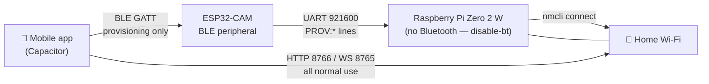
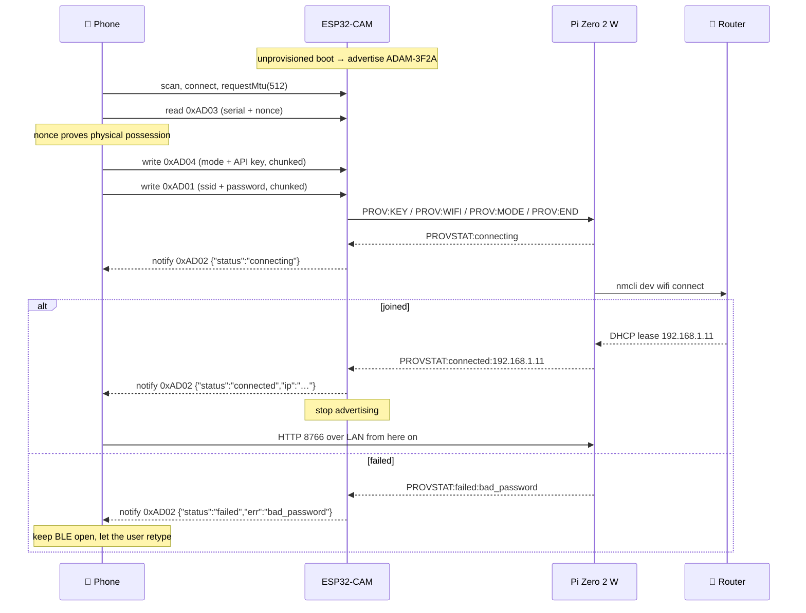

# Mobile app ⇄ ADAM — BLE provisioning and data sync

How the phone is meant to find ADAM, hand it Wi-Fi credentials over Bluetooth
LE, and then exchange data with it over the LAN.

> **Status: DESIGN, not documentation.** Verified 2026-10-05: there is **no BLE
> code in any firmware** (`esp32_cam.ino` and the Pico sketches contain no
> `BLEDevice`, `NimBLE`, `BLEServer` or `WiFi.softAP`), and the mobile app
> declares **no BLE Capacitor plugin**. Phase 3 (LAN data sync) is the only
> part that exists today. Everything in §3–§7 is a specification to build
> against, and nothing here should be described to anyone as working.

Related: [`features.md`](features.md), [`pc_app_integration.md`](pc_app_integration.md),
[`scheduler.md`](scheduler.md), `tasks_left.md` Category 2.

## 1. Why the ESP32 holds the radio, not the Pi

This is the decision the whole design turns on, and it is forced by hardware
already committed to.

The Pi Zero 2 W has `dtoverlay=disable-bt` in `/boot/firmware/config.txt`. That
is not incidental: it reassigns the high-quality **PL011** UART to
`/dev/serial0` so the ESP32-CAM link can run at **921600 baud** for camera
frames and motor control. The alternative (`miniuart-bt`) leaves Bluetooth
alive but moves the ESP32 onto the mini-UART, whose baud rate is tied to the
VPU core clock and drifts when the core clock scales — exactly the kind of
intermittent corruption that is miserable to diagnose on a live robot.

So: **the Pi has no usable Bluetooth, by choice, and getting it back costs the
camera link.** The ESP32-CAM already has a BLE radio sitting idle and already
has a reliable UART to the Pi. It takes the peripheral role.



**BLE is for setup only.** Once ADAM is on Wi-Fi, the phone talks to it over
the LAN, because BLE cannot carry conversation history, memories or camera
stills at any tolerable speed.

## 2. The three phases

| Phase | Transport | Carries | Built? |
|---|---|---|---|
| 1. Provision | BLE GATT, phone → ESP32 → Pi | Wi-Fi SSID/password, API key, mode, location | **No** |
| 2. Join | Pi → `nmcli`, status back over BLE | connection result and LAN IP | **No** |
| 3. Use | HTTP/WS over LAN, phone ⇄ Pi | schedules, todos, memories, conversations, telemetry | **Phase 3 server exists** |

## 3. BLE GATT contract

Advertised name: `ADAM-XXXX`, where `XXXX` is the last two bytes of the
ESP32's MAC in uppercase hex. This already matches `DeviceShortId` in
`packages/types/src/common.ts` (`/^ADAM-[0-9A-F]{4}$/`), so the app's
validation does not need to change.

**Primary service:** `19B10000-E8F2-537E-4F6C-D104768A1214`

| Characteristic | UUID | Props | Payload |
|---|---|---|---|
| Device Name | `0x2A00` | Read | `ADAM-3F2A` |
| Wi-Fi credentials | `0xAD01` | Write | `{"ssid":"…","password":"…"}` |
| Connection status | `0xAD02` | Read, **Notify** | `{"status":"connecting\|connected\|failed","ip":"…","err":"…"}` |
| Pairing proof | `0xAD03` | Read | `{"serial":"DGEN-ADAM-0007","nonce":"8f3b2a1c"}` |
| AI brain config | `0xAD04` | Write | `{"mode":"byok\|managed\|lite","key":"…"}` |
| Location handoff | `0xAD05` | Write | `{"city":"…","lat":22.57,"lon":88.36}` |

### The MTU problem — do not skip this

Default BLE ATT MTU is **23 bytes**, leaving **20 bytes** of payload per write.
Every realistic payload here is larger:

- a Gemini API key is ~39 characters
- a WPA2 passphrase may be 63
- the `0xAD01` JSON is comfortably over 100 bytes

So a naive single `writeValue()` **will silently truncate**. Two things are
required, and both must be implemented:

1. **Request an MTU bump** right after connect (`requestMtu(512)` on Android).
   Treat this as an optimisation, not a guarantee — iOS does not expose it and
   negotiates its own.
2. **Chunk regardless**, with an explicit framing so the ESP32 knows when a
   value is complete:

   ```
   {"i":0,"n":3,"d":"<base64 chunk>"}
   ```

   Reassemble on `i == n-1`. Reject and restart the transfer if chunks arrive
   out of order or a transfer is left incomplete for more than 10 s, so a
   half-written credential never reaches `nmcli`.

Writes must use **Write Request** (acknowledged), never Write Without
Response — a dropped credential chunk that nobody notices is the worst failure
mode available here.

## 4. UART relay — extending the protocol that already works

The Pi↔ESP32 link already carries line-oriented commands at 921600 baud:
Pi→ESP32 `EMO:happy\n`, `TILT:90\n`, `CAM:ON\n`; ESP32→Pi `'F'`+JPEG frames,
`'T'` touch, `'G'` gestures. Provisioning adds **ESP32→Pi** lines in the same
style, so no transport work is needed:

```
PROV:WIFI:<ssid>\t<password>
PROV:KEY:<api_key>
PROV:MODE:<byok|managed|lite>
PROV:LOC:<json>
PROV:END
```

and **Pi→ESP32** replies, which the ESP32 forwards to `0xAD02` as a notify:

```
PROVSTAT:connecting
PROVSTAT:connected:192.168.1.11
PROVSTAT:failed:bad_password
```

A tab separates SSID from password because an SSID may legally contain `:`
and a password very often does. Nothing here may be `print`ed by the ESP32 —
see §7.

Pi side: a new `provisioning.py` consumes `PROV:*` from `esp32_link.py`, writes
the credentials, and runs:

```bash
nmcli dev wifi connect "<ssid>" password "<password>"
```

## 5. Provisioning sequence



**On failure, BLE stays up.** A provisioning flow that drops the only channel
it has the moment the password is wrong strands the user with no way back in.

**SoftAP fallback** (`ADAM-Setup-XXXX`, matching the existing `SetupSsid` type)
is specified for phones where BLE is refused or unavailable, serving a setup
page on `192.168.4.1`. Also unimplemented.

## 6. Phase 3 — data sync over the LAN (this part exists)

Once ADAM is on Wi-Fi, the phone uses the **same API the PC app already uses**.
It is running today on the Pi.

| Method | Path | Purpose |
|---|---|---|
| `GET` | `/api/ping` | identity, version, read-only flag |
| `GET` | `/api/snapshot` | **everything in one call** — the normal fetch |
| `GET` | `/api/schedules` · `/api/todos` · `/api/memories` · `/api/conversations` | individual reads |
| `POST` | `/api/schedules` · `/api/todos` | add one |
| `PUT` | `/api/schedules` · `/api/todos` | replace the list |
| `POST` | `/api/todos/done` · `/api/todos/delete` · `/api/schedules/cancel` | single-item edits |

Plus a WebSocket on **8765** for live face/emotion state.

Rules the phone must follow, same as the PC app:

- **Reads need no credential. Writes require the `X-ADAM-Token` header**
  carrying the Pi's `SYNC_TOKEN`. An empty token on the Pi makes the whole API
  read-only rather than open — a missing secret disables writes instead of
  exposing them.
- **Prefer `/api/snapshot`.** Four round trips to paint one screen is three
  extra chances to render half-loaded.
- **Never write optimistically.** Send the edit, then re-render from the Pi's
  reply. The Pi is the source of truth; a failed write must not leave the UI
  claiming it landed.
- **Use single-item verbs** (`/api/todos/done`) rather than `PUT`-ing a whole
  list built from a snapshot. `snapshot()` is a *display* view: a repeating
  alarm's `at` is the recomputed next occurrence, and `snoozes` is omitted
  entirely. Feeding that back through a full replace silently destroys both.

### Finding the Pi again — an unsolved problem

Provisioning hands the phone an IP exactly once. **The Pi does not publish any
mDNS service record** (verified — there is no `register_service` call
anywhere in the Pi code), so when DHCP moves it, nothing re-discovers it.

This has already caused a real failure: the PC app had `192.168.0.128` saved
while the Pi had moved to `192.168.1.11` — a different subnet — and the Clock
tab simply reported "not connected". The PC app now falls back to the
hostname `adam-pi.local`, which avahi does answer.

The phone needs the same, and ideally better. Recommended, in order:

1. **Publish `_adam._tcp.local.` from the Pi** (port 8766, TXT carrying serial
   and version). This is a small addition to `sync_api.py` and fixes discovery
   for *every* client at once. **Do this one.**
2. Phone falls back to resolving `adam-pi.local` directly.
3. Phone keeps the last known IP and re-probes `/api/ping` on a short timeout
   before showing an error.

## 7. Security

**The provisioning window is the dangerous one.** During it, an unauthenticated
BLE peer can hand ADAM a Wi-Fi password and an API key.

- **Proof of possession.** `0xAD03` returns a one-time nonce the app must send
  back with `POST /devices/claim`. Being in Bluetooth range is not authorisation
  — reading a value only someone physically present can read is.
- **Advertise only while unprovisioned**, and stop the moment Wi-Fi is joined.
  A permanently discoverable provisioning service is a permanently open door.
- **Rate-limit and time-box.** Close the window after a few minutes or a few
  failed attempts; require a physical touch gesture to reopen it.
- **BLE "just works" pairing does not prevent MITM.** Treat the link as
  confidential only after bonding, and never send the API key before `0xAD03`
  has been read.

**Secrets must never be logged, on any of the three machines.** The ESP32 must
not `Serial.print` a credential — its debug UART is on the exposed header and
runs at boot. The Pi must not write them to journald. The phone must not put
them in analytics. This is the same rule that already governs the Gemini key:
`model_router._scrub()` redacts key-shaped text from errors *before* they reach
the model, because the model speaks what it is given.

**`PROV:` lines are plaintext over UART.** Acceptable — the wire is inside the
chassis — but it means the ESP32 must not echo them and must clear its
reassembly buffer immediately after forwarding.

## 8. What has to be built

| # | Work | Where | Depends on |
|---|---|---|---|
| 1 | BLE peripheral: service, 5 characteristics, chunked writes, MTU | `esp32_cam.ino` | — |
| 2 | `PROV:` emit + `PROVSTAT:` notify relay | `esp32_cam.ino` | 1 |
| 3 | `provisioning.py` — consume `PROV:`, run `nmcli`, report back | Pi | 2 |
| 4 | Publish `_adam._tcp.local.` | `sync_api.py` | — (do first, independently useful) |
| 5 | BLE client + onboarding screens | `apps/mobile-shell` | needs a BLE Capacitor plugin — none installed |
| 6 | LAN client against the 8766 API | `apps/mobile-shell` | 4 |
| 7 | SoftAP fallback portal | Pi or ESP32 | 3 |

**Item 4 is worth doing on its own,** before any BLE work. It is small, it fixes
a bug that has already bitten the PC app, and every later client benefits.

Item 5 is blocked on a dependency decision: the project uses Capacitor and has
no BLE plugin, so one must be chosen and added before the mobile side can start.
