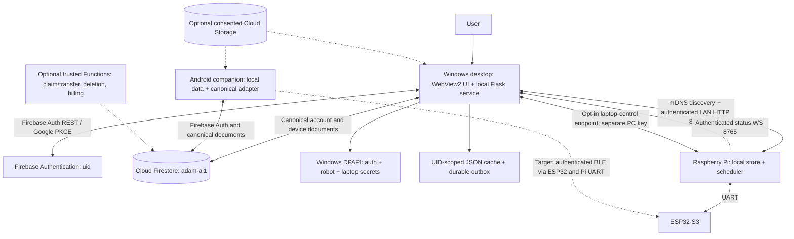
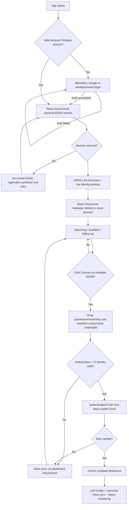
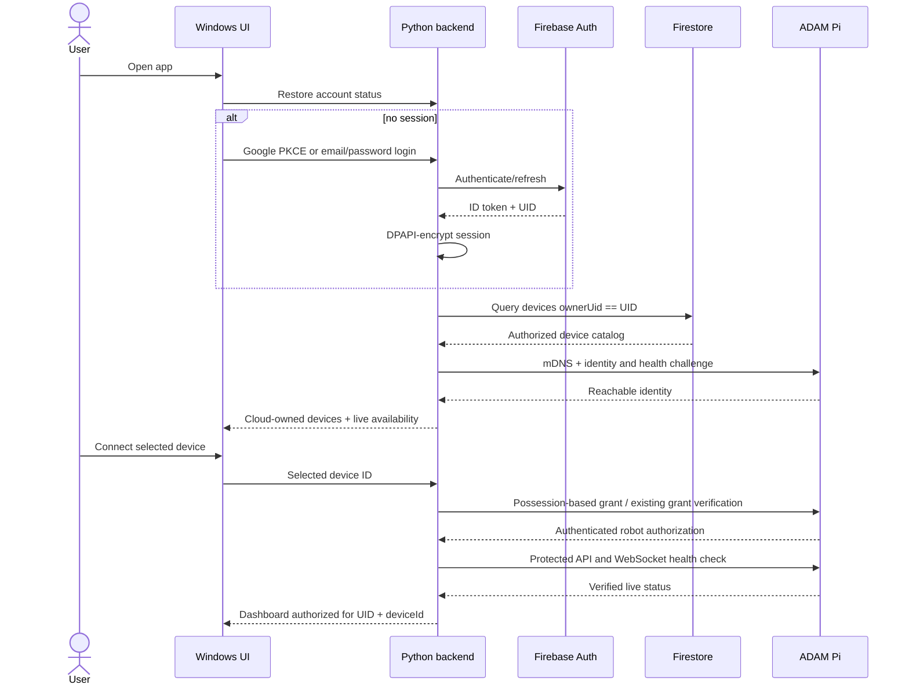
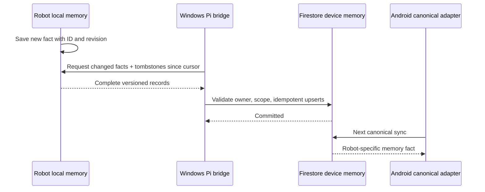
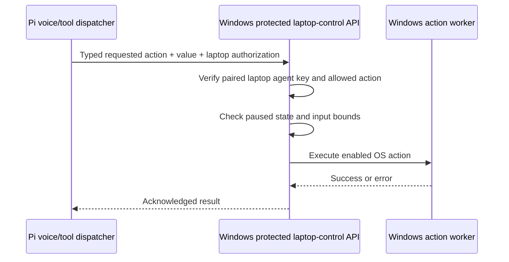

# ADAM — Final Windows Desktop Architecture, Data Contract and Integration Specification

**Document version:** 1.0 — target implementation specification  
**Date:** 9 October 2026  
**Repository:** `dgentechnologies/ADAM`  
**Primary architecture review (source of audited current behavior):** [COMPANION_ARCHITECTURE_AND_DATA_FLOW.md](COMPANION_ARCHITECTURE_AND_DATA_FLOW.md)  
**Approved desktop onboarding requirement:** [DESKTOP_LOGIN_AND_LAN_ONBOARDING_FLOW.md](DESKTOP_LOGIN_AND_LAN_ONBOARDING_FLOW.md)

> **Authority and status:** This document consolidates the **proposed final desktop contract**, not a statement that code or deployed Firebase rules already conform. The architecture review above remains the reference for **what is implemented today**. No live Firebase Console, deployed security rules, signed app build, or physical Pi acceptance was verified in producing this specification. Any examples labeled `proposed` require implementation, schema migration, and testing before production.

## 0. Executive decisions and non-goals

1. **Mandatory desktop account login:** Firebase Authentication with Google or email/password; no guest bypass. One person = one stable Firebase `uid` across desktop and Android.
2. **Device selection precedes dashboard:** query cloud-owned physical units, discover those units over LAN, show searching/available/offline, require Connect, verify physical authorization and a live connection, and only then unlock the full dashboard.
3. **One canonical database:** default Cloud Firestore in Firebase project `adam-ai1`. Desktop must stop using `users/{uid}.companion` as its active cloud sync destination after a coordinated migration.
4. **Clear roles:** Firestore stores shared **desired state** and ownership metadata; the Raspberry Pi stores its own **applied state** and performs alarm execution; a trusted desktop/mobile client bridges them. The Pi never receives a Firebase service-account key or connects directly to Firestore.
5. **Device-scoped robot memory:** people and facts learned by ADAM are attached to a specific physical `deviceId`. User plans (schedules, reminders, timers, to-dos) are attached to a `uid` and may target all or selected owned robots.
6. **No secret synchronization through normal Firestore:** Firebase tokens, Pi LAN pairing secrets, desktop-local session token, Wi-Fi credentials, API keys and laptop-control credentials stay in appropriate secure local stores or trusted backend secret management.
7. **Separate LAN and cloud operations:** high-frequency telemetry, voice actions, PC controls, audio, and camera streams do **not** transit Firestore. Canonical account data does.
8. **Explicit acknowledgements:** distinguish locally saved, cloud committed, awaiting robot delivery, received/applied by Pi, and executed/fired. A Firestore write is **not** evidence an alarm is armed on the robot.
9. **Safe first-time pairing:** cloud ownership and network reachability are necessary context but not possession proof. Automatic token management follows a verified pairing/possession step, without manual key copy/paste.
10. **Compatibility migration rather than split-brain:** account for existing desktop version-2 envelopes, Android canonical records, Pi JSON formats, account-local unsent edits and legacy identity mappings.

**Out of scope for this release:** cloud audio/video relay, automatic biometric upload, remote robot access outside the LAN, a required hosted desktop frontend, using Firestore as a command bus, production payment handling, and claims of instant sync with no online bridge.

## 1. Implementation inventory: existing versus target

| Layer / behavior | Audited current implementation (architecture review) | Required final behavior |
| --- | --- | --- |
| Windows UI | Python Flask 3/Waitress + pywebview 6, Edge WebView2, plain JS/HTML/CSS, Three.js; local tray app | Retain this lightweight native-shell architecture unless a separately approved migration changes it |
| Windows Auth | Firebase Auth REST; Google system-browser OAuth + PKCE; email/password; DPAPI token vault; optional local guest mode | Same proven login mechanisms, **mandatory at first launch** and refreshed on return |
| Account data | Guest/account JSON; cloud `users/{uid}.companion` v2 envelope | UID-scoped local cache/outbox + canonical Firestore document adapter; legacy envelope read only for one-time migration |
| Android | Firebase JS SDK, canonical Firestore adapter; setup/device linking partially simulated | Existing canonical schema and validation aligned with desktop; Android physical bridge still requires separate implementation |
| Cloud device registry | `devices/{deviceId}` and `ownerUid` (with legacy `ownerId`) | Verified device ownership, immutable owner under client writes, durable hardware ID and collision handling |
| Pi | Python/asyncio, local JSON schedules/memories, HTTP 8766, WebSocket 8765; independent scheduler | Versioned sync records, tombstones, idempotent bridge, explicit per-robot apply/execution acks |
| LAN connect | mDNS, zero-config LAN claim may give `SYNC_TOKEN`, manual input available | Cloud-owned shortlist, verified pairing/possession, automatically scoped per-desktop authorization; dashboard gate |
| Laptop control | Pi calls protected desktop `/control` after separate `/api/laptops/pair` | Keep **separate authorization and opt-in permissions** from robot data sync |
| Firebase Storage/Functions/FCM | Not established as active production companion services | Add only when specific trusted workflows/media/push features are approved and deployed |

## 2. Logical system architecture



**Connectivity matrix**

| From → To | Transport | Purpose | Source of authorization |
| --- | --- | --- | --- |
| Windows → Firebase Auth | TLS REST; Google system browser OAuth PKCE | sign-in, token refresh, account verification | Auth provider and Firebase session |
| Windows ↔ Firestore | TLS REST with Firebase ID token | owner-scoped canonical sync | Firebase Auth + deployed Firestore Security Rules |
| Windows ↔ Pi | mDNS discovery; authenticated LAN HTTP :8766 | identity/health, complete sync records, robot control | physical pairing plus Pi-scoped credentials |
| Pi → Windows | protected laptop endpoint /control | explicit voice-initiated PC actions | **separate** laptop-pairing token and per-action permission |
| Pi → Windows | authenticated WS :8765 | connection and live robot status | Pi session authorization |
| Pi ↔ ESP32-S3 | UART | head/peripheral control and future BLE bridge | device firmware framing and local trust boundary |
| Android ↔ ESP32-S3 | **target** permanent BLE | physical setup and low-volume record sync | authenticated pairing/framing, retries/acks |
| Windows/Android ↔ optional Storage | authenticated TLS | user-consented attachments only | storage rules and user consent |

**Never** use a cloud clock, LAN broadcast, BLE advert or a green icon as implicit evidence of physical execution.

## 3. Mandatory Windows first-run and return-user workflow



### Screen/view states and transitions

- **Splash/session restore:** bounded loading; no robot-control routes unlocked. Read the DPAPI-protected Firebase session, refresh if needed. Expired or revoked session returns to login.
- **Login:** Continue with Google (Windows system browser → PKCE callback → Firebase ID token); email registration/sign-in, password reset, error handling and explicit privacy/account text. No Skip button.
- **My ADAM devices:** fetch canonical device catalog for this UID. List real owned devices by stable ID, friendly name and explicit `Searching`, `Available on LAN`, or `Offline`. Exclude simulated units from physical connection.
- **Discovery:** probe mDNS/zeroconf advertisements and challenge the Pi's identity rather than trusting a text device name or MAC suffix alone. Match to a verified cloud device identity.
- **Connect:** initiate new pairing only with verifiable possession or use a previously authorized, unrevoked device-scoped credential. Never automatically transfer ownership of any discovered robot.
- **Verify:** check cloud ownership (authoritatively when online), Pi identity, authorized LAN HTTP, and status-channel handshake. Only then set `dashboardUnlocked=true` for the current authenticated UID and selected `deviceId`.
- **Dashboard:** selected-robot identity and online state, status/telemetry, local PC control permissions, plans, reminders, memories, logs and diagnostics, and cloud sync indicators. Distinguish cached from live values.
- **Network loss while open:** immediately disable live actions and label telemetry stale. Reconnect only after revalidation. This spec defaults to blocking the *full live dashboard* until reconnection; a future explicitly approved read-only/offline view can be separate.
- **Return launch:** recover Firebase session and DPAPI device grant; refresh catalog/ownership, perform discovery and authorization verification, then reconnect without token copy/paste.
- **Logout/account switch:** stop workers, close Pi and WebSocket sessions, clear active UID and selected-robot capability, quarantine prior UID's outbox, and return to login. Re-auth is mandatory.

### Credentials and pairing handshake (target protocol)

The architecture review records an existing Pi LAN claim that may return an environment/local `SYNC_TOKEN` to an unclaimed private-network peer. **That is insufficient for cloud-owner-secured zero-click production pairing.**

**Proposed secure sequence:**

1. App already holds a valid `uid` and cloud-owned `deviceId` record.
2. Desktop discovers a Pi with **durable unique hardware identity** and receives a fresh signed/challenged identity response.
3. For a never-paired desktop, user proves physical possession (e.g. physical-button confirmation or a short-lived robot-displayed pairing code). A trusted backend or an equivalent tamper-resistant authorization mechanism checks first-claim/transfer and binds the UID, hardware identity and grant. Exact possession implementation is a **design gate**.
4. Desktop and Pi establish a fresh client-specific scoped secret/session using an authenticated key-agreement/authorization mechanism. Define peer authentication and replay protection before coding; do not simply send a new password to an unauthenticated LAN peer.
5. Store the Windows credential in **DPAPI** with `uid`, `deviceId`, grant ID, expiry/scope; Pi stores only its local verifier, current grants and revocation state. Never place raw secrets in Firestore.
6. Verify a privileged test read and status handshake. The UI reports `Connected` only when checks succeed.
7. Rotation, revocation, robot transfer and new-PC authorization invalidate old grants. Reinstall must require the authorized recovery/possession flow, not raw token extraction from a cloud record.

**Trust requirement:** a Firebase ID token cannot simply be presented to an offline Pi as an authorization to mint a local key unless a complete authenticated validation and ownership protocol is designed. The Pi is not an Admin SDK client and should not be made one by distributing service credentials.

## 4. Ownership and IDs

| Identifier | Purpose | Rule |
| --- | --- | --- |
| Firebase `uid` | human/account identity | stable primary key for cloud owner isolation |
| `deviceId` | canonical physical robot document key | stable, unique and mapped to verified hardware; never local UUID-only |
| `hardwareSerial` / durable hardware identity | proof-linked manufacturing identity | collision-resistant; securely provisioned or verified; MAC-derived `ADAM-XXXX` only a display/discovery hint |
| Desktop `clientId` | one Windows installation | random stable installation identifier; no embedded secret |
| `pairingId` | descriptive connection/grant metadata | NOT a robot control key |
| Pi local auth grant ID | Pi LAN access capability | stored/verifiable locally; revocable and scoped |
| Windows laptop-agent key | Pi → laptop control | different token and scope from Pi data sync |
| `X-ADAM-Session` | local WebView → Flask access | per-process local UI session, not an account or Pi token |
| `origin` and operation ID | sync provenance/deduplication | stable for retries; not authorization |

The canonical `devices/{deviceId}.ownerUid` is authoritative, once backed by a verified claim process. `users/{uid}.linkedDeviceIds` is only a non-authoritative UI mirror. During migration, address records with legacy `ownerId` explicitly; never silently merge conflicting owner identities.

## 5. Canonical Firestore data model

**Notation:** `TS` means Firestore Timestamp in UTC; `wall time` means human schedule intent with an explicit named IANA timezone. Fields below labelled **proposed extension** require schema/rules changes. Do not deploy them as if already supported.

```text
Firebase Authentication
  uid

Cloud Firestore: adam-ai1 / (default)
  users/{uid}                                      account profile
    schedules/{scheduleId}                         user-owned alarms/reminders/timers
    todos/{todoId}                                 user-owned to-dos
    settings/companion                             PROPOSED canonical shared preferences
    notes/{noteId}                                 PROPOSED unassigned user notes
    clients/{clientId}                             PROPOSED non-secret sync cursors/metadata
    companion                                      LEGACY version-2 envelope FIELD; migrate/retire

  devices/{deviceId}                               physical identity + authoritative ownerUid
    memoryFacts/{factId}                           robot-specific fact metadata/content
    memoryPeople/{personId}                        robot-specific person metadata (no face vectors)
    laptopPairings/{pairingId}                     descriptive, non-secret metadata
    executionState/{scheduleId}                    PROPOSED device application/firing acks

  creditBalances/{deviceId}                        trusted-backend writes; owner read

  [optional backend-only claims/ledgers/migration metadata]
  [optional consent-based Cloud Storage media — separate service]
```

### Entity contracts and example documents

All cloud schemas require bounded validated types, `schemaVersion`, canonical IDs, documented nullable/optional fields, and explicit backfill/migration. These are **illustrative target examples**, not copy-paste active payloads.

**A. User profile — `users/{uid}`**

```json
{
  "displayName": "Example User",
  "email": "example@example.com",
  "photoUrl": null,
  "linkedDeviceIds": ["ADAM-REAL-001"],
  "createdAt": "TS",
  "updatedAt": "TS"
}
```

The document path UID (not email string) determines the owner. Profile cache may derive fields from Firebase Auth but updates need one agreed policy. Do not let profile writes grant device ownership.

**B. Physical robot — `devices/{deviceId}`**

```json
{
  "deviceId": "ADAM-REAL-001",
  "ownerUid": "<firebase-uid>",
  "name": "Desk ADAM",
  "hardwareSerial": "<verified-hardware-identity>",
  "kind": "physical",
  "createdAt": "TS",
  "updatedAt": "TS",
  "lastSeen": "TS"
}
```

Owner and immutable hardware identity can only be established/transferred by a trusted claim workflow after possession proof. `lastSeen` is an informational hint only. Current rules permit more than is safe for production; fix before enabling final onboarding.

**C. Schedule — `users/{uid}/schedules/{scheduleId}`**

```json
{
  "scheduleId": "sched-uuid",
  "kind": "alarm",
  "label": "Morning alarm",
  "at": "07:30",
  "timeZone": "Asia/Kolkata",
  "repeat": ["MO", "TU", "WE", "TH", "FR"],
  "enabled": true,
  "deviceIds": ["ADAM-REAL-001"],
  "createdAt": "TS",
  "updatedAt": "TS",
  "deleted": false,
  "deletedAt": null,
  "origin": "desktop:<clientId>",
  "schemaVersion": 1
}
```

`timeZone` and exact recurrence semantics require a coordinated schema decision. Preserve the canonical wall-clock `at` intent; do not collapse it into a desktop UTC-only `when`. If `deviceIds=[]` represents all owned units, evaluate against actual ownership and handle the case of ownership changing. Timer duration/deadline/restart rules need separate fields; never misrepresent a countdown as an alarm clock timestamp. **Per-robot last-fired and applied state belongs under device execution state, not one globally shared `lastFired` field.**

**D. To-do — `users/{uid}/todos/{todoId}`**

```json
{
  "todoId": "todo-uuid",
  "text": "Review the PCB",
  "done": false,
  "due": null,
  "doneAt": null,
  "deviceIds": [],
  "createdAt": "TS",
  "updatedAt": "TS",
  "deleted": false,
  "deletedAt": null,
  "origin": "desktop:<clientId>",
  "schemaVersion": 1
}
```

**E. Device memory fact — `devices/{deviceId}/memoryFacts/{factId}`**

```json
{
  "factId": "fact-uuid",
  "category": "preference",
  "content": "Prefers concise updates",
  "confidence": 0.9,
  "source": "conversation",
  "learnedAt": "TS",
  "createdAt": "TS",
  "updatedAt": "TS",
  "deleted": false,
  "deletedAt": null,
  "origin": "pi:<deviceId>",
  "schemaVersion": 1
}
```

Memory belongs to the robot identified in the path; no automatic copy to every ADAM. Pi current flat memory files do not yet supply all necessary per-entry revision metadata.

**F. Device person — `devices/{deviceId}/memoryPeople/{personId}`**

```json
{
  "personId": "person-uuid",
  "name": "Example",
  "relationship": "colleague",
  "notes": "",
  "faceEncodingId": null,
  "firstSeen": "TS",
  "lastSeen": "TS",
  "updatedAt": "TS",
  "deleted": false,
  "deletedAt": null,
  "schemaVersion": 1
}
```

`faceEncodingId` is reference metadata only; face embeddings, images, camera recordings and conversation transcripts remain robot/device-local unless separately approved and consented.

**G. Laptop pairing metadata — `devices/{deviceId}/laptopPairings/{pairingId}`**

```json
{
  "pairingId": "pairing-uuid",
  "clientId": "desktop-install-uuid",
  "name": "Office PC",
  "os": "windows",
  "lastSeen": "TS",
  "updatedAt": "TS"
}
```

Never include host control keys, `SYNC_TOKEN`, raw bearer tokens, Wi-Fi passwords or robot authorization secrets here. Record-level access to laptop-pairing metadata does not authorize live PC controls.

**H. Shared settings — `users/{uid}/settings/companion` (proposed)**

```json
{
  "voice": "default",
  "wakeWord": "adam",
  "brain": "byok",
  "updatedAt": "TS",
  "origin": "desktop:<clientId>",
  "schemaVersion": 1
}
```

`brain` is a selection, not a billed entitlement. BYOK Gemini credentials stay in the local secret vault; managed credits/billing must be backend-verified. Define per-field conflict behavior to avoid an unrelated settings edit overwriting another.

**I. Unassigned notes — `users/{uid}/notes/{noteId}` (proposed)**

Use `noteId`, `content`, `createdAt`, `updatedAt`, `deleted`, `deletedAt`, `origin`; distinguish personal account notes from `devices/{deviceId}/memoryFacts`. Never silently assign historical unscoped envelope notes to a robot.

**J. Desktop sync-client metadata — `users/{uid}/clients/{clientId}` (proposed)**

Store only `platform`, `protocolVersion`, non-secret cursor / last acknowledged revision, and `lastSeen`. **No credentials, device grants, tokens, API keys, or secrets.** Prune stale clients only under a documented offline horizon.

**K. Robot execution acknowledgement — `devices/{deviceId}/executionState/{scheduleId}` (proposed)**

Store `scheduleId`, `receivedRevision`, `appliedRevision`, `lastOccurrenceId`, `lastFiredAt`, `status`, `error`, `reportedAt`, and `origin`. Only a verified authenticated bridge should report *actual Pi evidence*; a client must never fabricate an execution-success record.

**L. Credits — `creditBalances/{deviceId}`**

Client reads only when authorized, never changes balance, entitlements or recharge totals. Trusted backend writes only after verified payment events with deduplication and an auditable ledger.

### Data ownership table

| Data | Authority | Local cache | Sync transport |
| --- | --- | --- | --- |
| Firebase identity | Firebase Auth | encrypted Windows session | Auth REST |
| Device ownership | verified registry in Firestore + trusted claim | non-authoritative desktop cache | Firestore |
| Schedules/to-dos desired state | canonical user collections | durable UID cache/outbox and Pi filtered replica | Firestore ↔ desktop ↔ authenticated Pi LAN |
| Robot memories | device-scoped canonical collections when bridge complete; Pi until sent | Pi memory + desktop scoped cache | authenticated Pi LAN ↔ desktop ↔ Firestore |
| Alarm delivery/firing | Pi scheduler | Pi execution state | Pi → desktop bridge → device-scoped ack |
| Settings | proposed canonical settings document | UID cache; private settings local | Firestore |
| Photos/biometrics/dialogue | local device by default | local only | no automatic Firestore sync |
| Laptop action commands | Windows local control worker | ephemeral request/audit | Pi → authenticated Windows LAN endpoint |
| Raw keys/token/session | DPAPI / Pi vault / Android Keystore | local secret vault only | **never normal Firestore sync** |

## 6. Windows application modules and responsibilities

Retain existing local Flask + Waitress + WebView2 structure and partition services by trust boundary:

```text
Windows ADAM
  UI / routing / visual components
    login, my-devices, LAN-scanning, secure-pairing, connection-error
    dashboard, schedules, todos, memories, devices, diagnostics, settings
  Local Python HTTP backend
    AccountService          Firebase REST login, refresh, logout, UID scope
    DeviceCatalogService    owner-scoped Firestore device list
    DiscoveryService        mDNS + verified Pi identity probes
    PairingService          possession/authorization handshake, DPAPI grants
    ConnectionService       selected Pi connection, health, WS telemetry
    CanonicalCloudAdapter   Firestore user and device collection CRUD
    SyncCoordinator         durable outbox, conflict resolution, tombstones
    PiBridgeService         authenticated Pi sync API, filtering, acks
    SchedulerViewService    read Pi snapshot separately from sync raw state
    LaptopControlService    separate opt-in PC-action API and permissions
    LocalPersistence        atomic UID-scoped cache + journal
    SecretVault             Windows current-user DPAPI
    UI session middleware   per-process X-ADAM-Session protection
  External
    Firebase Auth + default Firestore
    Raspberry Pi HTTP :8766, WebSocket :8765
    Windows APIs for enabled PC actions
```

**Suggested backend route namespaces (proposed; existing endpoints must be audited before replacement):**

| Namespace | Purpose | Authorization |
| --- | --- | --- |
| `/auth/*` | login start/callback, email login, status, logout | CSRF/state protection; safe local UI session; never expose token values |
| `/devices/cloud/*` | list owned devices / cached list and refresh | current Firebase UID |
| `/devices/discovery/*` | LAN scan, probe, availability | local app session; unverified devices never grant privileged control |
| `/devices/connect/*` | possession grant, connect, verify, disconnect | current UID + verified cloud device + Pi grant |
| `/dashboard/*` | aggregated status, robot-safe actions | **verified live selected-robot connection** |
| `/sync/*` | canonical exchange, outbox status, conflicts | current UID, record scope, account epoch |
| `/pi/sync/*` | per-record raw Pi sync bridge | Pi grant + ownership + target checks |
| `/laptop-control/*` | opt-in enabled local PC actions | distinct laptop agent key and per-action allowlist |
| `/health` | bounded, redacted health data | no secrets or privileged access |

**Security note:** the Windows desktop WebView has its own local `X-ADAM-Session` route protection. Neither being logged in to Firebase nor holding a robot `SYNC_TOKEN` should automatically unlock arbitrary local OS operations.

### Dashboard contents and derived state

- Selected ADAM label, stable `deviceId`, live connection state, firmware/runtime metadata if available.
- Pi uptime/health/telemetry where actually observed; stale data clearly timestamped.
- Cloud auth and sync state separately from robot reachability.
- Plans, alarms, reminders, to-dos, memory viewer, per-robot logs and diagnostics.
- Laptop control pairing status, permissions, pause/stop controls (separate from ADAM data pairing).
- A per-item delivery indicator: `saved locally` → `synced to cloud` → `pending robot` → `robot applied` → `fired / failed`.
- Device switching must stop old device-specific work, validate target ownership/grant, and prevent wrong-device writes.

## 7. Common calling process and message flow

### A. Login → owned-device catalog → connect



**Login token detail:** Android signs in using native Google ID token + Firebase credential; Windows desktop uses Google **access token** obtained via system-browser OAuth code + PKCE, then Firebase `signInWithIdp`. Do not conflate their Google token audiences. Desktop email login uses Firebase REST. Firebase session refresh token is DPAPI-encrypted; UI sees safe status only.

### B. User edits a schedule on Windows

```mermaid
sequenceDiagram
    actor User
    participant UI as Windows UI
    participant Local as UID cache + outbox
    participant DB as Canonical Firestore
    participant Bridge as Pi bridge
    participant Pi as Robot scheduler
    User->>UI: Create/edit/delete schedule
    UI->>Local: Validate; atomic save + stable operation ID
    Local-->>UI: Saved locally
    Local->>DB: Idempotent canonical document write / tombstone
    DB-->>Local: Committed revision
    Local-->>UI: Synced to cloud
    Local->>Bridge: Queue target device revisions
    Bridge->>Pi: Authenticated idempotent per-record upsert/delete
    Pi-->>Bridge: Applied revision / failure
    Bridge-->>UI: Robot applied or pending/error
    Pi-->>Bridge: Later fired occurrence evidence
```

Firestore write success is never displayed as `alarm armed`. Failed delivery stays pending until bridge returns. Pi remains the sole authority on actual firing, including deduplication after restart.

### C. Pi-created memory → account data → another app



This flow requires new per-entry Pi memory versioning and a full sync API. The current Pi display/snapshot projection is not a valid source of complete replication metadata.

### D. Voice command → Windows control



Needle/tool function calling and conversational model processing are separate from this local control transport. Do not persist each PC button press as a Firestore command and do not reuse Firebase Auth as laptop action authorization.

## 8. Synchronization protocol — normative target behavior

### Record envelope shared across TypeScript/Python/Pi

Each synchronizable entity must have:
```text
recordId       stable ID within collection
schemaVersion  validated schema generation
createdAt      UTC creation bookkeeping
updatedAt      UTC last accepted write bookkeeping
deleted        boolean tombstone indicator
deletedAt      UTC time or null
origin         stable client/device source
operationId    stable UUID for retry/deduplication (proposed)
revision       monotonic accepted revision or equivalent deterministic conflict token (proposed)
deviceIds      only where record is user-plan-targetable
```

**Clock rule:** creation/update/deletion metadata is UTC; schedule wall time and named timezone are *intent*, not a replication-order clock. Do not use second-precision naive Pi timestamps or local PC timezone conversion as the sole version comparator. If server-assigned revisions are chosen, document how offline edits reconcile before enabling.

### Write/read algorithm

1. **Validate + scope:** check current Firebase UID, owned device scope, entity type, schemaVersion and limits; never write a record to another UID/device. Explicitly fence requests by `accountEpoch` and selected `deviceId`.
2. **Save first:** atomically persist modified record and durable outbox operation before confirming local save.
3. **Fetch canonical:** read affected record or versioned changed set from Firestore using the current user's ID token; validate incoming shapes and ownership.
4. **Merge deterministically:** use one shared algorithm for mobile, desktop, Pi bridge; define equal revision, concurrent edit, delete/update races and clock skew. For unresolved concurrent writes, preserve both candidate states in conflict metadata rather than silently discard.
5. **Commit idempotently:** use preconditions/transactions on per-document writes where needed; retry with backoff and jitter; stable operation IDs prevent duplicate record creation.
6. **Record checkpoint only on success:** persist per-UID and per-device cursors/acks after committed changes. Restarting the client must not lose pending writes.
7. **Bridge to Pi:** filter by actual ownership and plan targets; send full stored records/tombstones, never a derived UI snapshot; process bounded batches without interfering with real-time audio.
8. **Pi apply ack:** persist each accepted version before acknowledging. Forward real Pi evidence to per-device execution state; no fabricated `lastFired`.
9. **Resync:** on stale cursor, tombstone retirement, schema upgrade or ID-map change, do a verified full bootstrap without resurrecting a deletion.

**Offline behavior:** Windows can save eligible local edits while cloud temporarily fails only within a previously authenticated UID context; since the proposed full dashboard requires live Pi connectivity, any future offline editor must be explicitly separated from the live dashboard gate. No bridge app online means cloud and Pi eventually converge **only after a bridge reconnects**.

**Deletion:** propagate tombstones through Firestore and Pi. Do not hard-delete active canonical plans without an agreed acknowledgement and retention horizon. Pi's existing 30-day tombstone pruning is not automatically safe for indefinitely offline devices. Account deletion requires recursive backend cleanup.

**Multiple robots:** an empty target `deviceIds` means all owned ADAM units only if the schema contract explicitly retains this meaning. Keep per-robot received/applied/fired cursor separate. One robot's `lastFired` must never suppress another robot's alarm.

**Current adapter differences to remove:** desktop v2 `companion` envelope vs mobile canonical collections; Android equal-timestamp tie handling vs desktop envelope merge; Pi naive local timestamps; missing cloud settings/unassigned notes and Pi memory versions.

## 9. Firestore Security Rules — target policy and reference sketch

**IMPORTANT:** The following is a **design sketch**, not a production-ready deployed rules file. It intentionally denies unapproved paths. Field-type/size checks, document cross-reference validations, query compatibility, access-call budget, migration tests, billing authorization, collection-group queries and exact approved schema must be implemented/tested before deployment. A client-side claim that it owns a device is NOT trusted.

### Policy matrix

| Resource | Authenticated user | Trusted backend | Additional rule |
| --- | --- | --- | --- |
| `users/{uid}` | read/update own safe profile | administrative lifecycle where needed | UID matches; disallow unrestricted owner/role fields, legacy companion writes once retired |
| `users/{uid}/schedules/*` | own create/read/update (soft delete) | limited maintenance | validated schema, immutable IDs, no client hard delete |
| `users/{uid}/todos/*` | own create/read/update (soft delete) | limited maintenance | same |
| `users/{uid}/settings/companion` | own read/write safe settings | maintenance | never API keys, tokens or entitlement grants |
| `users/{uid}/notes/*` | own read/create/update/tombstone | maintenance | bounded personal notes |
| `users/{uid}/clients/*` | own non-secret client status | maintenance | no control credentials |
| `devices/{deviceId}` | owner read, safe name/settings updates | only trusted claim/transfer/owner assignment | ownerUid and immutable hardware identity cannot be changed by client |
| `devices/{deviceId}/memoryFacts/*` | owner read/create/update/tombstone | cleanup | prevent foreign-device access; validate fact fields |
| `devices/{deviceId}/memoryPeople/*` | owner read/create/update/tombstone | cleanup | metadata only, no embedding payloads |
| `devices/{deviceId}/laptopPairings/*` | owner read/update safe descriptive metadata | cleanup | not proof of live control authorization |
| `devices/{deviceId}/executionState/*` | owner read; writes only from validated bridge/trusted workflow | authoritative writes | clients must not invent applied/fired status |
| `creditBalances/{deviceId}` | verified owner read | trusted write | balance not client-modifiable |
| all other paths | deny | explicitly scoped backend operation | default deny |

### Example **illustrative** deny-by-default rules skeleton

```javascript
rules_version = '2';
service cloud.firestore {
  match /databases/{database}/documents {
    function signedIn() {
      return request.auth != null;
    }
    function isUser(uid) {
      return signedIn() && request.auth.uid == uid;
    }
    function ownsDevice(deviceId) {
      return signedIn()
        && exists(/databases/$(database)/documents/devices/$(deviceId))
        && get(/databases/$(database)/documents/devices/$(deviceId)).data.ownerUid == request.auth.uid;
    }

    match /users/{uid} {
      allow read: if isUser(uid);
      // TODO: constrain editable profile keys and types, immutable identity,
      // request.resource schema, linkedDeviceIds and legacy migration.
      allow create, update: if false;
      allow delete: if false;

      match /schedules/{id} {
        allow read: if isUser(uid);
        // TODO: implement strict validated create/update with immutable id,
        // bounded deviceIds and soft-delete-only behavior.
        allow create, update, delete: if false;
      }
      match /todos/{id} {
        allow read: if isUser(uid);
        allow create, update, delete: if false;
      }
      match /settings/{settingId} {
        allow read: if isUser(uid) && settingId == "companion";
        allow write: if false;
      }
      match /notes/{noteId} {
        allow read: if isUser(uid);
        allow write: if false;
      }
      match /clients/{clientId} {
        allow read: if isUser(uid);
        allow write: if false;
      }
    }

    match /devices/{deviceId} {
      allow read: if ownsDevice(deviceId);
      // All ownership creation/transfer and hardware identity changes are
      // server-authorized, NEVER caller-supplied client ownerUid.
      allow create, update, delete: if false;

      match /memoryFacts/{factId} {
        allow read: if ownsDevice(deviceId);
        allow write: if false; // replace with strict owner CRUD validator
      }
      match /memoryPeople/{personId} {
        allow read: if ownsDevice(deviceId);
        allow write: if false;
      }
      match /laptopPairings/{pairingId} {
        allow read: if ownsDevice(deviceId);
        allow write: if false;
      }
      match /executionState/{scheduleId} {
        allow read: if ownsDevice(deviceId);
        allow write: if false; // trusted / validated reporting design
      }
    }

    match /creditBalances/{deviceId} {
      allow read: if ownsDevice(deviceId);
      allow write: if false;
    }

    match /{document=**} {
      allow read, write: if false;
    }
  }
}
```

This skeleton is intentionally **read-only for authorized user/device documents** until validators are finished. **Do not deploy it over the running app as-is**: it would break client writes. It states the security boundary, not a completed drop-in replacement. Production rules must authorize the policy matrix's scoped client writes only after schema validators and emulator tests pass. Firebase Admin SDK bypasses Security Rules and therefore requires tightly controlled trusted backend access.

### Exact rule hardening checklist

- `ownerUid` and hardware serial immutable under ordinary client updates; ownership creation/transfer only after verified possession by privileged backend.
- Remove legacy `ownerId` authorization after a mapped migration; reject disagreement during transition.
- Validate allowed keys, types, bounded strings/arrays, timestamps, IDs, no nested credentials and no forged owner fields.
- Use `diff().affectedKeys()` or equivalent whitelist checks for safe user/device field updates.
- Reject plan references to devices not owned by the requester; define query/index needs and rule access limits before shipping.
- Soft-delete/tombstone constraints and retention protections; reject uncontrolled parent and subcollection hard deletes.
- Never let client write credit balances, backend roles, privileged billing flags, pairing secrets, or robot execution success without verified evidence.
- Test cross-UID read/list/write denial, unauthorized device claim, mutation of ownerUid, synthetic offline robot, ID collisions and revocation in Firebase Emulator; verify actual deployed rules/version separately.
- Keep cloud Auth/rules separate from the physical Pi possession authorization.

## 10. Local files, scopes and storage

| Local component | Contents | Requirements |
| --- | --- | --- |
| `%APPDATA%/ADAM` / configured `ADAM_DATA_DIR` | UI settings, UID-scoped canonical cache, durable outbox, sync cursors | atomic write/rename, validation, backup/migration and corruption recovery |
| current UID-scoped cache | plans, safe preferences, allowed device memory, current catalog | never mix prior UID data when switching accounts |
| per-UID outbox | pending operations with stable IDs, retries and local schema version | persist before reporting locally saved; fence by UID and device |
| DPAPI secret vault | Firebase refresh/ID session, local Pi grant, laptop-control grant | encrypt using current Windows user; never JSON plaintext, Firestore or UI |
| local WebView session | process-scoped `X-ADAM-Session` | protect private routes; rotate on restart as appropriate |
| Pi `adam_schedules.json` | live schedule/to-do records + tombstones | execute locally; expose complete versioned sync records |
| Pi `adam_memory.json` and face/conversation files | robot memory, face and dialogue information | upgrade memory versioning; keep biometric/transcript material local |
| Pi pairing files | robot authorization and laptop endpoint | distinct capabilities; never cloud-sync raw secrets |

Version-2 desktop guest/account envelopes may remain as read-only migration inputs/backups until verified convergence and rollback horizon. The **final live desktop cache format is canonical**, not a second Firestore schema.

## 11. Failure matrix and recovery

| Failure | UI | Required backend behavior |
| --- | --- | --- |
| Login fails/expired | login + targeted error | no dashboard; clear or refresh invalid session safely |
| User signed in, no device | no registered ADAM | do not claim random LAN robot |
| Cloud device found, Pi not | offline/searching | discovery retries; never green connected |
| LAN advert without verified ownership | unavailable/unowned | cannot connect privileged routes |
| First-time pairing not verified | authorization required | no token issuance; allow secure reattempt |
| Robot identity mismatch | connection failed | discard session and report; no control requests |
| Pi WS or API down | reconnecting; actions disabled | stop stale telemetry/commands, preserve cloud outbox |
| Firestore offline | local pending/cloud unavailable | durable retry, no fabricated cloud commit |
| Pi offline after cloud commit | waiting for ADAM | retain per-device queue until applied ack |
| Sync conflict | conflict/pending resolution | preserve both revisions if no deterministic resolution |
| Delete during long offline | tombstone pending | resync protocol prevents resurrection |
| Account switched mid-request | new login/device scope | reject old-epoch results and pending cross-account writes |
| Robot transferred/revoked | authorization lost | revoke grants; reject old user and stale cache |
| PC action disabled/paused | action rejected | no OS command run despite Pi reachability |
| App crash between save and send | pending after restart | durable journal replays idempotently |

## 12. Migration and coordinated rollout

**Phase 0 — Freeze a shared contract.** Review canonical fields above with Android/Pi owners. Decide hardware identity, original/migrated ID mapping, timezones and DST policy, conflict ordering, outbox revision semantics, settings and unassigned notes, account deletion and tombstone horizon. Publish shared validation fixtures across TypeScript/Python.

**Phase 1 — Back up and inventory.** Enumerate existing `users/{uid}.companion` version-2 envelopes, Android canonical documents, device `ownerUid`/`ownerId` mappings and unsent local data. Run a dry-run migration with per-ID/tombstone accounting. Preserve old data until confirmed.

**Phase 2 — Align Windows with canonical Firestore.** Implement owner-scoped authenticated REST adapters for `users/{uid}/schedules`, `todos`, device facts/people and approved new settings/notes. Profile bootstrap, account scopes and validation must match mobile. Stop writing the legacy `companion` field behind a coordinated migration/version gate, not indefinitely dual-write.

**Phase 3 — Secure cloud ownership.** Implement trusted physical claim, durable robot identity and ownership-transfer/revocation. Harden and deploy tested Firestore rules *before* treating a device catalog as secure authorization.

**Phase 4 — Mandatory desktop first-run.** Enforce login → cloud-owned catalog → LAN scan → user Connect → verified automatic grant → authenticated Pi health → dashboard. Replace/manual-token-first behavior only after tested secure pairing and recovery.

**Phase 5 — Pi record bridge.** Extend raw Pi sync API with versioned schedules/to-dos/memories, stable IDs, timestamps/tombstones, retry/ack and per-device execution state. Preserve existing scheduler semantics. Wire Windows bidirectional canonical ↔ Pi exchange.

**Phase 6 — Android physical BLE.** Add real Android ↔ ESP32-S3 BLE ↔ Pi UART authenticated transfer with bounded chunking/ack/retry. Do not mistake current simulation and firmware provisioning for the final path.

**Phase 7 — Lifecycle and release.** Add trusted account deletion, owner transfer and billing only when designed. Verify deployed rules, auth providers, signed OAuth configuration, 2 PCs + 2 phones + 2 physical ADAM units, offline/retry/duplicate operations, rollback plan, and no stale legacy writers.

### Release acceptance tests (minimum)

- First launch offers only Firebase Google/email login and blocks dashboard until successful.
- Both desktop auth methods return the correct `uid`, refresh safely, survive restart, and isolate another signed-in UID.
- Cloud-owned devices list correctly; unreachable are offline; unowned LAN devices remain unconnectable.
- First pairing requires possession proof and creates local scoped DPAPI-protected credentials without any manual `SYNC_TOKEN`.
- Subsequent launch reconnects authorized device; revoked/transferred devices fail closed.
- Pi API and status stream both verified; LAN outage disables live controls; device switching fences old work.
- Desktop-to-Android schedule/to-do CRUD and tombstone convergence works **via canonical collections**, not envelope similarity.
- Desktop/Pi/cloud scheduling and Pi voice-created memory travel both ways with stable IDs and no duplicates.
- Cloud save is distinct from Pi applied, and per-device execution state distinguishes multiple target robots.
- Equal/concurrent edits, stale clients, account switches, corrupt caches, app crash mid-transfer, delayed Pi bridge and incompatible schema fail safely.
- Device owner fields, credits, execution acknowledgements and unrelated UID collections are protected by deployed rule tests.
- Control commands travel by separately paired authorized LAN control, never as Firestore documents.
- No biometrics, transcripts, keys, tokens or hidden photos are uploaded during ordinary sync.

## 13. Decisions that must be signed off before production

1. What constitutes durable hardware identity and how is it provisioned and tied to `deviceId`?
2. What is the exact possession proof, trusted claim, grants/rotation and revocation protocol?
3. What is the canonical schemaVersion and supported coexistence/migration horizon?
4. What are cross-platform conflict priorities and authoritative revision semantics?
5. What are timer duration, zone/DST and recurrence rules?
6. What is the per-robot execution acknowledgement contract and authenticated reporter model?
7. Which settings/notes are user-shared versus robot-scoped versus always-local?
8. What offline/read-only view, if any, is permitted behind the strict dashboard connection gate?
9. What deletion/retention and legacy-client compatibility policy is approved?

**Source traceability:** Every audited-current statement above is grounded in [COMPANION_ARCHITECTURE_AND_DATA_FLOW.md](COMPANION_ARCHITECTURE_AND_DATA_FLOW.md). The mandatory desktop UX and connection gate are from [DESKTOP_LOGIN_AND_LAN_ONBOARDING_FLOW.md](DESKTOP_LOGIN_AND_LAN_ONBOARDING_FLOW.md). New schemas, security rules, API route namespaces, verification handshakes, execution status and migration stages are **explicit implementation proposals**, not already-deployed behavior.
