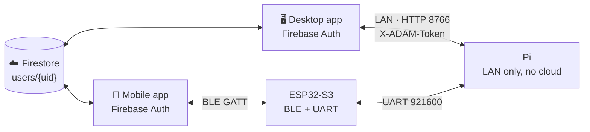

# ADAM — canonical cloud data schema

**Status:** this document is the agreement. Where it disagrees with code, the
code is wrong and should be changed to match — except where a section is marked
**EXISTS**, which describes what is already deployed and must not be renamed.

**Project:** Firebase `adam-ai1` (Firestore)
**Audience:** the Android/web companion app, the Windows desktop app, the Pi
runtime, and the relay server. All four touch this data.
**Last verified against code:** 2026-10-09

---

## 1. Why this document exists

There are currently **three different schemas** in this repository and no
single place that says which is authoritative. That is the whole problem.

| Where | Collections | Purpose | Shares anything? |
|---|---|---|---|
| `adam-mobile/firestore.rules` + `packages/types/src/firestore.ts` | `users`, `devices`, `creditBalances` | the companion app | — |
| `adam-web-demo/relay-server/src/firestoreClient.js` | `adamUsers`, `demoSessions`, `waitlist` | the public web demo | **no overlap** |
| `MP-MC codes/pi/adam/` | *(none — local JSON files only)* | the robot | **no cloud at all** |

Two traps that follow from the table:

1. **`adamUsers` is not `users`.** They are different collections with
   different shapes serving different products. Nothing should read one
   expecting the other, and neither should be "unified" into the other without
   a migration — the demo's documents are session/waitlist records, not
   accounts that own devices.
2. **The Pi writes nothing to the cloud today.** Its data lives in
   `adam_memory.json`, `adam_faces.json` and `adam_schedules.json` on the SD
   card. Any statement that ADAM's data is "synced" is currently false.

---

## 2. Identity and ownership

```
users/{uid}                     uid = Firebase Auth UID
devices/{deviceId}              deviceId = the unit's stable short id, e.g. "ADAM-47F8"
```

`deviceId` **must** be the unit's stable identifier — the same string the Pi
advertises over mDNS and returns from `GET /api/pair/info`. On the Pi that is
`discovery.short_id()`, derived from the wlan0 MAC, so it survives reboots,
reflashes and DHCP changes. Do not use a random UUID per install: the whole
point is that the phone, the desktop and the robot all name the same unit the
same way.

Ownership is `devices/{deviceId}.ownerUid == users/{uid}`, mirrored by
`users/{uid}.linkedDeviceIds[]`. The mirror is a convenience for listing;
`ownerUid` is the authority, and the security rules check it.

---

## 3. EXISTS — do not rename

These are deployed and enforced by `firestore.rules`. Field names are frozen.

### 3.1 `users/{uid}`

| Field | Type | Notes |
|---|---|---|
| `email` | string | |
| `displayName` | string | |
| `photoUrl` | string \| null | **Display-only avatar from Google Sign-In.** Never a captured camera image or face scan. |
| `createdAt` | timestamp | |
| `linkedDeviceIds` | string[] | mirror of ownership |

### 3.2 `devices/{deviceId}`

`deviceId`, `ownerUid`, `name`, `hardwareSerial`, `bleAddress`, `wifiSsid`,
`tailscaleIp`, `osVersion`, `lastSeen`, `createdAt`,
`status: "online"|"offline"|"setup"`.

Optional/compat: `ownerId`, `serial`, `isFounderEdition`, `founderNumber`,
`aiBrainMode: "byok"|"managed"|"lite"`.

> The `ownerId`/`ownerUid` pair is a real wart: the rules accept **either**.
> New writers must set `ownerUid`. `ownerId` is read-only legacy.

### 3.3 `devices/{deviceId}/memoryFacts/{factId}`

`factId`, `category`, `content`, `confidence` (0–1, default 1.0), `learnedAt`,
`source: "conversation"|"vision"|"manual"`. Compat aliases: `key`, `value`,
`savedAt`.

### 3.4 `devices/{deviceId}/memoryPeople/{personId}`

`personId`, `name`, `relationship`, `faceEncodingId` (nullable), `notes`,
`firstSeen`, `lastSeen`. Compat alias: `lastSeenAt`.

> `faceEncodingId` is a **reference**, not an embedding. Face vectors stay on
> the device. Nothing in this schema stores biometric data in the cloud, and
> adding it would need a privacy decision, not just a field.

### 3.5 `devices/{deviceId}/laptopPairings/{pairingId}`

`pairingId`, `hostname`, `os`, `tailscaleIp`, `pairedAt`, `lastActive`.
Compat: `laptopName`, `lastActiveAt`, `revoked`.

### 3.6 `creditBalances/{deviceId}`

`deviceId`, `balance`, `currency: "credits"`, `lastUpdated`, `autoRecharge`,
`rechargeThreshold`.

**Client-write-protected** (`allow write: if false`). Backend service accounts
only. Do not try to write it from an app; the rule will reject it and that is
intentional.

---

## 4. PROPOSED — schedules and todos

**These collections do not exist yet.** They are required for the
cross-device sync of alarms, timers, reminders and todos.

### 4.1 Scoping: user-level, device-targeted

```
users/{uid}/schedules/{scheduleId}
users/{uid}/todos/{todoId}
```

Under the **user**, not the device — with a `deviceIds` field to target.

The reasoning matters, because the obvious alternative is wrong. A 7 am alarm
belongs to a *person*: it should appear on their phone, their desktop and every
ADAM they own. Putting it under `devices/{deviceId}` would mean an alarm set on
the phone has no home until a device is chosen, and would not show up on a
second ADAM at all. But an alarm still has to *ring* somewhere physical — so
targeting cannot be dropped either.

Hence: owned by the user, with `deviceIds: []` meaning "all my units" and a
populated array meaning "only these".

Memories stay under `devices/{deviceId}` where they already are. That is the
right call and should not be "fixed" to match: a memory is something *that
robot* learned in *that room*. Two ADAMs in one house should not share the
belief that the user's chair is to the left.

### 4.2 `users/{uid}/schedules/{scheduleId}`

| Field | Type | Notes |
|---|---|---|
| `scheduleId` | string | matches the doc id; Pi ids like `al_c8e761a3` are fine |
| `kind` | `"alarm" \| "timer" \| "reminder"` | matches the Pi's `KINDS` exactly |
| `label` | string | what the user called it |
| `at` | string | **local wall-clock** ISO-ish `YYYY-MM-DDTHH:MM`, no zone — see §4.4 |
| `timeOfDay` | string \| null | `"HH:MM"` for repeating alarms |
| `repeat` | string[] \| null | weekday subset of `mon…sun`, the Pi's `WEEKDAY_NAMES` |
| `enabled` | boolean | |
| `deviceIds` | string[] | empty = every unit this user owns |
| `lastFired` | string \| null | the Pi's duplicate-fire guard; cloud copies it, never invents it |
| `snoozes` | number | |
| `createdAt` / `updatedAt` | timestamp | `updatedAt` drives conflict resolution |
| `deleted` | boolean | tombstone — see §5 |
| `deletedAt` | timestamp \| null | |
| `origin` | `"pi" \| "desktop" \| "mobile"` | who last wrote it; for debugging only |

### 4.3 `users/{uid}/todos/{todoId}`

`todoId`, `text`, `done` (boolean), `due` (string \| null), `deviceIds`,
`createdAt`, `updatedAt`, `doneAt` (nullable), `deleted`, `deletedAt`,
`origin`.

### 4.4 Times are local wall-clock strings, deliberately

`at` and `timeOfDay` are **not** UTC timestamps and **not** Firestore
`Timestamp`s. They are the literal local time the user said.

This mirrors a decision already made and documented on the Pi
(`pi/docs/scheduler.md`): next-fire times are computed with `datetime.now()`,
so "07:00" rings at 07:00 on the wall clock the user is looking at, including
the morning after a DST change — which is what a person means by "7 am".
Converting to UTC in the cloud and back would reintroduce exactly the bug the
Pi avoids, and an alarm that drifts by an hour twice a year is worse than one
that ignores time zones.

`createdAt`, `updatedAt`, `doneAt`, `deletedAt` **are** real UTC timestamps —
they are machine bookkeeping, not user intent.

---

## 5. Authority and conflicts — read this before writing sync code

Three writers (Pi, desktop, mobile), and the Pi is frequently offline. Without
one rule the data will corrupt quietly.

**The rule: last-write-wins per document, compared on `updatedAt`.**

- Every writer sets `updatedAt` on every write.
- A client applies an incoming doc only if its `updatedAt` is **newer** than
  the local copy's. Equal timestamps mean no change; do not overwrite.
- Conflict granularity is the **document**, not the field. Two devices editing
  the same todo means one edit loses. That is acceptable for alarms and todos;
  it would not be for a shared text document, which is why nothing here is one.

**Deletes are tombstones, never removals.**

Set `deleted: true` and `deletedAt`. Do not call Firestore `delete()` from a
client.

This is not bureaucracy — it is the one thing that breaks obviously if skipped.
Delete a todo on the phone, and the Pi (which was offline and never heard) still
has its copy. On reconnect the Pi pushes it back and the todo **returns from the
dead**. A tombstone is the only way the Pi can learn that absence was
intentional. Tombstones older than 30 days may be purged by a backend job, never
by a client.

**The Pi is authoritative for firing, the cloud is authoritative for
existence.** The Pi decides *when* an alarm rings and owns `lastFired` — the
cloud copies that field and must never compute it. The cloud decides *which*
alarms exist across devices.

---

## 6. Who talks to the cloud — settled

**The Pi never touches Firestore.** Not through a service account, not through a
device token, not at all. It has no Firebase credentials and must not acquire
any: shipping one on an SD card in a consumer device means a single extracted
card compromises every account.

The two apps are the bridge. Each already authenticates the user with Firebase,
so the user's own login is the only credential involved.



**Two different transports to the same robot, and they are not interchangeable:**

| | Desktop app | Mobile app |
|---|---|---|
| Transport to ADAM | **LAN**, HTTP on 8766 | **BLE GATT**, via the ESP32 |
| Auth to ADAM | `X-ADAM-Token` (paired) | BLE pairing + proof-of-possession |
| Needs same Wi-Fi | yes | **no** |
| Throughput | fine for anything | ~20 B/write default, ~250 B at negotiated MTU |
| Status | **working** (`sync_api.py`) | **not built** |

The mobile app going over BLE rather than LAN is a deliberate product choice:
the phone reaches ADAM in a hotel room, on mobile data, or before ADAM has any
Wi-Fi at all. It costs throughput, which is affordable here only because this
data is kilobytes — a few dozen todos and memories, never camera frames.

### 6.1 Consequence: BLE is no longer provisioning-only

`pi/docs/mobile_ble_sync.md` describes BLE as a setup-time channel that stops
advertising once Wi-Fi is joined. **That is now wrong** and that document needs
revising: BLE is the mobile app's permanent data path, so the service must stay
available after provisioning, and it needs data characteristics on top of the
provisioning ones.

Required additions, none of which exist yet:

| Characteristic | Purpose |
|---|---|
| `0xAD10` data request (write, chunked) | `{"op":"get","what":"todos"}` / `{"op":"put","what":"todos","rows":[...]}` |
| `0xAD11` data response (read + notify, chunked) | the answer, framed like §6.2 |

And a matching UART pair, extending the `PROV:` convention already in the S3
firmware:

```
ESP32 → Pi :  SYNC:REQ:<json>
Pi → ESP32 :  SYNC:RES:<json>
```

### 6.2 Chunking is mandatory on the BLE path

Default ATT MTU is 23 bytes — 20 usable. A single todo row exceeds that, and a
15-entry memory dict is well over a kilobyte. Both directions must frame:

```json
{"i": 0, "n": 7, "d": "<slice>"}
```

Reassemble on `i == n-1`; discard and restart on an out-of-order index or a
transfer idle longer than 10 s. Request an MTU bump (`requestMtu(256)`) as an
optimisation, never as a precondition — iOS negotiates its own and will not
honour it.

This is the same framing the provisioning characteristics already specify, so
it is one implementation, not two.

---

## 6.3 The Pi records are missing the field sync depends on

Verified against the live unit on 2026-10-09 — this is a **blocker**, not a
detail.

| Store | Fields today | Has `updated_at`? |
|---|---|---|
| `adam_schedules.json` → schedules | `id, kind, label, at, repeat, enabled, last_fired, snoozes, created` | **no** |
| `adam_schedules.json` → todos | `id, text, done, created, due, done_at` | **no** |
| `adam_memory.json` | flat `{key: value}` | **no timestamps at all** |

§5 specifies last-write-wins compared on `updatedAt`. With no such field on the
Pi side there is nothing to compare, so a bridge would have to guess which copy
is newer — and guessing wrong silently destroys whichever edit it discards.

**Required before any sync code is written:**

1. `scheduler.py` stamps `updated_at` (local wall-clock, matching `created`) on
   every create and every mutation of a schedule or todo.
2. Deletes become tombstones in the Pi's own store too: `deleted: true` plus
   `deleted_at`, instead of dropping the row from the list. Otherwise the Pi
   cannot tell the cloud that an absence was deliberate, and §5's tombstone
   rule only protects one direction.
3. Memories need a per-entry record rather than a bare dict — at minimum
   `{value, updated_at}` — or the same resurrection bug applies to every fact
   ADAM has ever learned.

Item 3 is the invasive one: `adam_memory.json`'s flat shape is read directly by
`memory_store.py` and injected into the prompt, so changing it touches the
prompt assembly path. A migration that reads both shapes is the safe route.

**None of this is in the audio path** (§0.3), so it is all legitimately
editable — but it is a real change to the Pi's storage format and should land as
its own reviewed step, not folded into a sync feature.

---

## 7. Field mapping — Pi local files ⇄ cloud

The shapes genuinely differ; this is the translation table.

### 7.1 Memories

Pi `adam_memory.json` is a flat dict:

```json
{ "favorite_pizza": "mushroom and cheese", "user_realname": "Tirthankar" }
```

Cloud `memoryFacts` is a document per fact:

| Pi | Cloud field |
|---|---|
| dict key | `category` (and `key`, the compat alias) |
| dict value | `content` (and `value`) |
| — | `factId` — derive deterministically from the key, e.g. a slug/hash, so re-syncing the same fact updates one doc instead of creating duplicates |
| — | `source: "conversation"` for things ADAM learned, `"manual"` for user edits |
| — | `confidence: 1.0` |
| — | `learnedAt` — file mtime if nothing better |

The **deterministic `factId`** is the part worth getting right. A random id per
push means every sync creates a new document and the user's memory list grows
forever with duplicates.

### 7.2 People

Pi `adam_faces.json` → `memoryPeople`. `faceEncodingId` is a reference only;
the embedding stays on the device (§3.4).

### 7.3 Schedules and todos

Pi `adam_schedules.json` is `{"version": 1, "schedules": [...], "todos": [...]}`
and maps 1:1 onto §4.2/§4.3. The Pi's own field names (`id`, `kind`, `label`,
`at`, `repeat`, `enabled`, `last_fired`, `snoozes`) are already close; note
`last_fired` → `lastFired` (snake_case on the Pi, camelCase in Firestore).

**Casing convention:** Firestore documents are camelCase. The Pi is snake_case.
The translation happens in the sync layer, once, in one place — not scattered
through callers.

---

## 8. Security rules still needed

`firestore.rules` has no rules for §4. Without them the new collections are
**inaccessible** (Firestore denies by default), so this is a blocker, not a
nicety:

```
match /users/{uid}/schedules/{scheduleId} {
  allow read, write: if isOwner(uid);
}
match /users/{uid}/todos/{todoId} {
  allow read, write: if isOwner(uid);
}
```

`isOwner(uid)` already exists in the rules file.

---

## 9. Open decisions

1. ~~Which backend path for the Pi~~ — **SETTLED (§6).** The Pi never touches
   Firestore. The desktop app bridges over LAN; the mobile app bridges over
   BLE. No cloud credential ever reaches the device.
2. **Does a second ADAM on the same account share todos?** §4.1 proposes yes,
   via `deviceIds: []` meaning "all my units". If units should be fully
   independent the default flips and the field becomes mandatory.
3. **Tombstone retention** — 30 days is a guess. A client offline longer than
   the window will resurrect deleted rows.
4. **Conversation history** — deliberately excluded from this schema. The Pi
   keeps the last 60 turns locally and the sync API already gates them behind
   the token as personal data. Putting transcripts in the cloud is a privacy
   decision to make explicitly, not to inherit from a sync feature.
5. **Who wins when both apps are online?** Both bridges can write the same
   document. §5's last-write-wins handles it, but only once §6.3 gives the Pi
   an `updated_at` to compare against.
6. **What happens to a Pi edit made while both apps are shut?** Nothing
   transmits it until an app next connects, so ADAM is the only holder of that
   change for a while. That is acceptable, but it means "synced across all
   devices" is true *eventually*, not immediately, and the UI should not
   imply otherwise.

## 10. Build order

The dependency chain matters — items 1 and 2 are prerequisites, not polish.

| # | Step | Where | Blocks |
|---|---|---|---|
| 1 | `updated_at` + tombstones on schedules/todos | `pi/adam/scheduler.py` | all sync |
| 2 | Timestamped memory records (+ read-both-shapes migration) | `pi/adam/memory_store.py` | memory sync |
| 3 | Firestore rules for `users/{uid}/schedules|todos` (§8) | `adam-mobile/firestore.rules` | all sync |
| 4 | Desktop bridge: Pi ⇄ Firestore over LAN | `adam-desktop/src/` | — |
| 5 | Memory editing UI | `adam-desktop/resources/static/` | 2 |
| 6 | BLE data characteristics `0xAD10`/`0xAD11` + chunking | `esp32_s3_head.ino` | — |
| 7 | `SYNC:REQ`/`SYNC:RES` UART handlers | `pi/adam/esp32_link.py`, `sync_api.py` | 6 |
| 8 | Mobile bridge: BLE ⇄ Firestore | `adam-mobile/` | 6, 7 |

Steps 6–8 are the larger half and only affect the phone. Steps 1–5 deliver
working cross-device sync for the desktop on their own, which is why they come
first.

## 10. Files

| File | Role |
|---|---|
| `adam-mobile/firestore.rules` | enforced rules — authoritative for §3 |
| `adam-mobile/packages/types/src/firestore.ts` | Zod models for §3 |
| `adam-mobile/packages/types/src/memory.ts` | the app's view model (`MemoryEntry`) |
| `adam-web-demo/relay-server/src/firestoreClient.js` | the **separate** demo schema (§1) |
| `MP-MC codes/pi/adam/memory_store.py` | Pi memory + conversation log |
| `MP-MC codes/pi/adam/scheduler.py` | Pi schedules/todos, `adam_schedules.json` |
| `MP-MC codes/pi/adam/sync_api.py` | the Pi's HTTP surface |
| `MP-MC codes/pi/docs/scheduler.md` | why times are local wall-clock (§4.4) |
