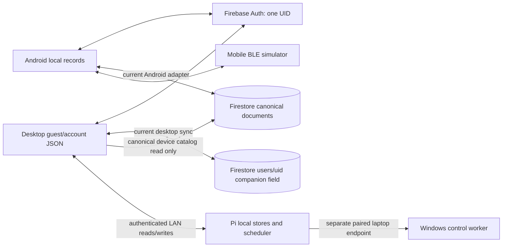
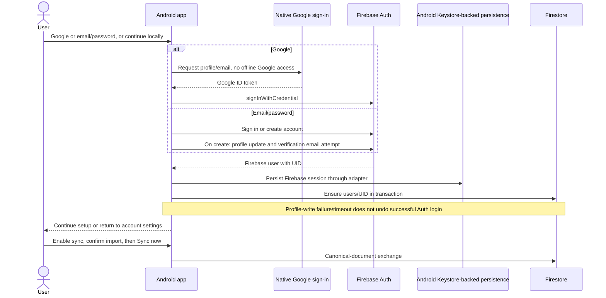
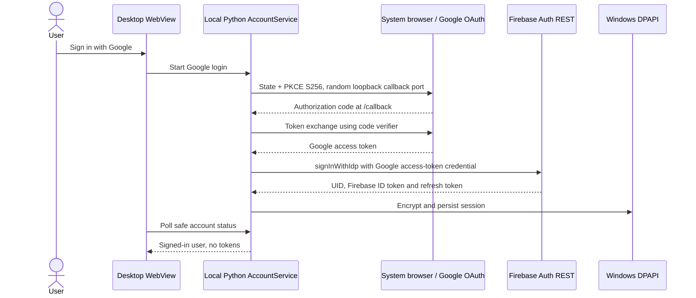
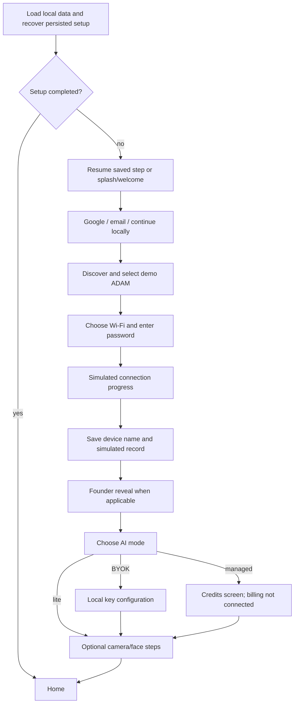
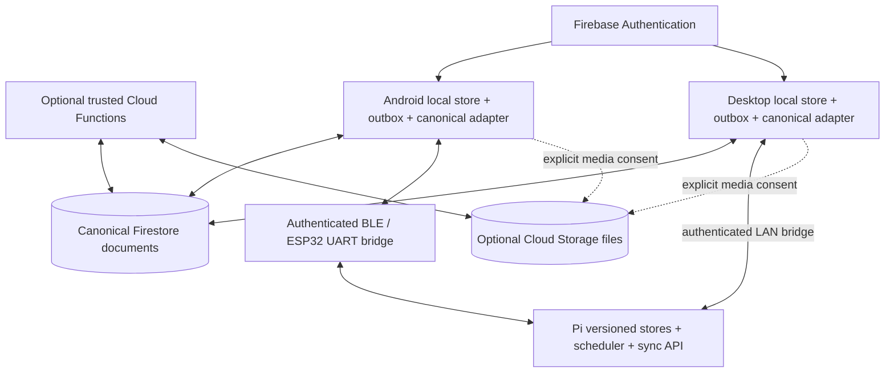

# ADAM: desktop, Android and centralized data architecture

**Review date:** 9 October 2026  
**Source baseline:** `main`, commit `2e88b31` (`updates`)  
**Purpose:** document the current system and define the work needed before both apps and every owned ADAM can share consistent data. This is a design and source review; it does not implement or deploy the upgrade.

## 1. Executive finding and scope

Both apps use Firebase project **`adam-ai1`** and Firebase Authentication, but **they do not currently use the same cloud data path for synchronization**:

- **Android:** the active sync adapter writes separate canonical Firestore documents: user schedules/to-dos, device records, and device-scoped memories.
- **Windows desktop:** `CloudSync.sync()` still reads/writes the version-2 envelope at **`users/{uid}.companion`**.
- **Physical ADAM:** schedules, to-dos, memories and pairing state live on the Pi. Desktop can read and change some of this over LAN, but a complete Pi-to-canonical-Firestore bridge is not implemented.
- **Mobile physical-device setup/sync:** the current app uses simulated discovery, Wi-Fi handoff and BLE data transfer. Firmware provisioning code exists, but this does not establish a working phone-to-robot setup or data-sync flow.

Signing in to the same account is necessary, but these differences mean it is **not sufficient** to make all devices show the same data today. A saved cloud clock is also not proof that a physical robot has received or armed an alarm.

This document covers technology stacks, authentication, onboarding, physical pairing, local and cloud storage, synchronization, Firebase configuration, future serverless services, migration and acceptance checks. Live Firebase Console settings, deployed rules, installed binaries and physical devices were not inspected in this review. Release documents' historical test results are not a new live acceptance test.

### How to read the existing documents

| Source | Role and review finding |
| --- | --- |
| [CLOUD_DATA_SCHEMA.md](CLOUD_DATA_SCHEMA.md) | Intended canonical collection layout and product decisions: user-owned plans, device-owned robot memories, apps bridge the Pi, no Firebase credentials on the Pi. Its implementation-status statements need updating. |
| [Shared companion protocol](../shared/COMPANION_PROTOCOL.md) | Describes the version-2 envelope, merge rules and simulator contract. Its claim that both apps synchronize `users/{uid}.companion` is outdated for the current Android adapter. |
| [Desktop sync protocol](../adam-desktop/docs/SYNC_PROTOCOL.md) | Useful for desktop OAuth, DPAPI, envelope merge and conditional writes. Its mobile version-1/manual-only sections are historical. |
| [Android 0.2.2 release notes](../adam-mobile/docs/RELEASE_0.2.2.md) | Records prior tests and outstanding live OAuth/account acceptance. It does not prove the later canonical adapter interoperates with desktop. |
| [Mobile BLE design](<../MP-MC codes/pi/docs/mobile_ble_sync.md>) | Older provisioning-only/LAN design. Its claim that no firmware BLE code exists is outdated; the permanent BLE data path in CLOUD_DATA_SCHEMA.md is still an intended upgrade. |

For this audit, runtime call sites establish **current behavior**. CLOUD_DATA_SCHEMA.md establishes **intended direction**, except for unresolved design choices explicitly listed below. Recommendations in this document are not a second deployed schema.

## 2. Technology stack

### Android and browser companion

| Layer | Current technology | Architectural consequence |
| --- | --- | --- |
| UI | Next.js **15.1.3**, React **19.0.0**, TypeScript **5.7.2** | Next.js static export is bundled in the app; a Next.js server is not required on the user's laptop. |
| Styling/components | Tailwind CSS **3.4.17**, shared `@adam/ui`, Lucide, Framer Motion | Shared product screens inside an Android WebView. |
| State and validation | Zustand **5.0.2**, Zod **3.24.1**, React Hook Form; TanStack Query dependency | Setup state, local records and cloud boundaries have different validators; they must remain compatible. |
| Native shell | Capacitor **6.2.0**, Java Android plugins, Android System WebView | Android permissions and device APIs are accessed through native bridges. |
| Android toolchain | Node **20.11+**, pnpm **9.12.3**, Turborepo **2.3.3**, Java **17**, Android SDK **35**, minimum SDK **23** | Release signing and package/certificate registration are separate from JavaScript builds. |
| Firebase client | Firebase JS SDK **12.18.0** | Firebase Auth and Firestore run through the web app, including in the native shell. Native Firestore is configured for long polling. |
| Google login | `@codetrix-studio/capacitor-google-auth` **3.4.0-rc.4** | Android obtains a Google ID token and exchanges it for Firebase credentials; browser development uses a popup. |
| Ordinary local data | Capacitor Preferences; browser `localStorage`; IndexedDB for gallery blobs | Local persistence is not itself cloud sync. Ordinary records are not stored in the secret vault. |
| Secrets | Custom `Companion` plugin: Android Keystore-backed AES-GCM; custom Firebase persistence adapter | Firebase sessions and application secrets are protected on Android. The browser secret helper is memory-only. |
| Native features | Camera, filesystem, sharing, app/status-bar plugins; notification listener | Photos, face profiles and notifications remain local by default. |
| Development API | Fastify **5.2.0**, TypeScript/tsx, Zod; Prisma **6.1.0** tooling | `apps/api` is scaffolding, not the production account database. Its presence does not establish a deployed SQL database. |

Sources: [workspace manifest](../adam-mobile/package.json), [web manifest](../adam-mobile/apps/web/package.json), [native shell manifest](../adam-mobile/apps/mobile-shell/package.json), [Android variables](../adam-mobile/apps/mobile-shell/android/variables.gradle), [native persistence](../adam-mobile/apps/web/src/lib/native/auth-persistence.ts).

### Windows desktop companion

| Layer | Current technology | Architectural consequence |
| --- | --- | --- |
| Runtime/backend | Python, Flask **3.0.0**, Waitress **3.0.2** | A local HTTP service hosts the UI and exposes a separately protected laptop-control API. |
| Native window/tray | pywebview **6.2.1**, Microsoft Edge WebView2, pystray **0.19.5** | Windows-native lifecycle with an HTML/CSS/JavaScript UI. This is not an Electron or React desktop app. |
| UI/3D | Plain JavaScript, HTML/CSS, bundled Three.js and model assets | Local UI calls the Python service; no cloud-hosted desktop frontend is required. |
| Firebase access | `requests` **2.31.0** using Firebase Auth REST and Firestore REST | No Python Firebase Admin credential is needed or shipped for ordinary user operations. |
| Google login | System browser OAuth authorization code + PKCE S256, local callback | Separate installed-desktop OAuth client in the same Google/Firebase project. |
| Local data | JSON files under `ADAM_DATA_DIR` or `%APPDATA%/ADAM` | Separate guest/account files; cloud operations must preserve pending local changes. |
| Secret storage | Windows current-user DPAPI | Firebase sessions, robot keys and laptop control keys are not ordinary cloud records. |
| Discovery/status | zeroconf **0.150.0**, websockets **15.0.1** | mDNS discovery, Pi HTTP data service and WebSocket telemetry are distinct channels. |
| PC controls | pycaw, comtypes, screen-brightness-control **0.22.1**, pyperclip, Windows APIs | Audio/display actions depend on Windows drivers, permissions and reachable laptop service. |
| Packaging/testing | PyInstaller **6.16.0**, pytest **8.4.2**, Windows smoke script, jsdom UI tests | A source change requires a new Windows build before it affects an installed executable. |

Sources: [requirements](../adam-desktop/requirements.txt), [development requirements](../adam-desktop/requirements-dev.txt), [app entry](../adam-desktop/src/app.py), [backend](../adam-desktop/src/backend.py), [packaging](../adam-desktop/scripts/build.py).

### Robot and infrastructure boundary

The Pi runtime is Python/asyncio with local JSON persistence, a scheduler, LAN HTTP on **8766**, and live WebSocket status on **8765**. The ESP32-S3 head firmware is C++/Arduino with NimBLE provisioning code and UART communication with the Pi. The intended mobile bridge is permanent BLE through the ESP32; the current firmware and app do not yet implement the complete cloud-data bridge.

Firebase is the account/control-data backend. It is separate from Gemini voice processing, local PC controls, Home Assistant, camera streams and the public web-demo relay. Do not route real-time microphone/camera traffic or every brightness command through Firestore.

## 3. Firebase service inventory

| Service | Evidence in this checkout | Intended use |
| --- | --- | --- |
| **Firebase Authentication** | Implemented in both apps: Google, email/password, session refresh and sign-out | One Firebase UID for a person across Android, browser and desktop. |
| **Cloud Firestore** | Implemented, but Android canonical documents and desktop legacy envelope differ | Central structured account/device/plan/memory database after migration. Database path is `(default)`. |
| **Cloud Storage for Firebase** | Mobile config names `adam-ai1.firebasestorage.app`; no active companion upload/download flow or Storage rules were identified | Optional future user-approved attachments/backup media. A configured bucket name is not evidence of media sync. |
| **Cloud Functions for Firebase** | No companion Functions implementation/deployment configuration identified | Future trusted ownership, account deletion, billing and migration/maintenance operations; see §12. |
| **Firebase Cloud Messaging** | No active companion push integration identified | Optional future “changes available” wake-up notification. The database remains authoritative. |
| **Firebase App Check** | No active integration identified | Future abuse mitigation where supported. It does not replace Firebase Auth, rules or physical pairing. |
| **Firebase Hosting / App Hosting** | No production hosting deployment established by this review | Optional browser companion hosting. Android's bundled static export does not require it. |
| **Realtime Database** | No active usage identified | Not required for the proposed architecture; avoid introducing a second account-data authority. |

**Database versus file storage:** Firestore holds structured documents and file metadata; Cloud Storage would hold binary objects. Photos do not belong as base64 payloads in Firestore documents. API keys, refresh tokens, Wi-Fi credentials and robot control keys belong in secure local storage, not either general-purpose cloud store.

## 4. Current system and its separate identities



The two Firestore boxes are paths in the **same database**, not different Firebase projects. There is no implemented automatic replication between those paths.

| Identity | Current form | What it proves |
| --- | --- | --- |
| Person/account | Firebase Auth `uid` | Cloud access as that user. An email address or display name is not a stable primary key. |
| Physical ADAM | `discovery.short_id()`, currently `ADAM-XXXX`, exposed by `/api/pair/info` | Robot identifier for discovery and canonical `devices/{deviceId}` naming; it is not an authentication secret. |
| App-local saved device | UUID record `id` | Identity of an app record. Android additionally carries a canonical `deviceId`. |
| Simulated ADAM | Canonical `ADAM-SIM-<UUID>` on Android | A demo/test record only; never proof of physical ownership. |
| Local robot authorization | Pi `SYNC_TOKEN`, obtained manually or through LAN claim | Permission to use the Pi's protected HTTP API. It is not a Firebase identity. |
| Laptop authorization | Desktop-generated agent token, host and actual port | Permission for ADAM to invoke enabled controls on one PC. |
| Desktop UI session | Per-process `X-ADAM-Session` | Permission for the local WebView to use private desktop routes. |

**Keep these states separate in both apps:** signed in, cloud sync enabled, device cloud-owned, physically paired, currently reachable, writes authorized, and latest data applied. A single “connected” flag cannot represent all of them.

The short robot identifier uses only a MAC suffix and is not guaranteed globally unique. Older BLE design text derives it from the ESP32 MAC while current Pi discovery uses the Pi WLAN MAC. Before a production ownership registry, specify one durable hardware identity and a collision/mapping strategy without silently renaming existing cloud documents.

## 5. Login and account lifecycle

### Android current login flow



- The sign-in screen requires its acceptance checkbox before Google/email actions. Skipping login continues local setup.
- Native Google login requests a token using the configured web/server OAuth client ID; Android package/signing-certificate configuration must match the release. Browser development uses Firebase `signInWithPopup`.
- `ensureUserDocument()` creates profile fields only when the document is missing and preserves existing data. It is bounded by a five-second UI fallback.
- Login completion routes to `/discover` for new setup, or `/settings/account` if setup was already completed. It does not verify that a real robot is linked.
- `checkAuthStateAndLinkedDevice()` currently returns `hasLinkedDevice: false` after restoring auth; it does not establish physical ownership from Firestore.
- Sign-out clears Firebase/native Google login but intentionally leaves phone-local content. The per-UID sync baseline and owner marker prevent automatic import into the next account; that account must explicitly consent.

### Windows current login flow



- Google uses a **Desktop app OAuth client** belonging to `adam-ai1`, not the Android OAuth client. The callback validates state, host and path and has a three-minute deadline. Cancel/sign-out invalidates pending callbacks.
- The desktop exchanges the **Google access token**, not its desktop-audience Google ID token, with Firebase. This deliberately differs from the Android SDK credential path.
- Email/password uses Firebase Auth REST `signUp`/`signInWithPassword`; password reset uses `sendOobCode`. Passwords are not persisted.
- The desktop creation path does not currently mirror Android's verification-email attempt or Firestore profile initialization. Successful desktop sync can create a user document containing only `companion`. Profile backfill and a consistent verification policy belong in the upgrade.
- Refresh tokens and ID tokens are stored in DPAPI-protected `firebase-session`; token refresh uses Firebase's Secure Token endpoint. Public UI responses expose only safe account metadata.
- Desktop separates guest and account data files. Guest import is explicit. Switching accounts changes scope and fences in-flight work; it is not a transfer of the old account's records.

### Shared account rules for the upgrade

Use the **same Firebase UID**, not merely matching email strings, as the shared identity. Specify provider linking and “account exists with different credential” recovery rather than creating a second account silently. Align email verification, profile creation/update, reauthentication, sign-out and deletion behavior. Guest mode remains valid, but all guest-to-account import must be explicit and reversible through backups.

Account deletion currently needs particular attention: Android disables sync, deletes `users/{uid}`, then deletes the Firebase Auth user. Firestore does **not** cascade parent deletion to `schedules`/`todos`, device subcollections or Storage objects. Once data is in canonical subcollections, this is not complete account erasure. A trusted, retryable cleanup workflow is required before promising full deletion.

## 6. Initial setup and physical pairing

### Android setup screens: implemented navigation, simulated robot operations



The actual linear order/branches are centralized in `setup-flow.ts`; non-Founder units skip the reveal. Setup state persists independently of memories and secrets. Corrupt setup state has a recovery path; corrupt user content must not be replaced with empty defaults.

Current `connecting/page.tsx` calls `runHandoff` from the mock API. Naming explicitly saves `simulated: true`; `ble-simulation.ts` exchanges bounded documents with a local simulated robot. These are useful UI/test paths, **not physical Wi-Fi provisioning, verified robot ownership or durable robot alarm delivery**. Camera/face steps save local data; they do not authorize uploading biometrics.

The ESP32-S3 firmware has `AD01`–`AD05` provisioning characteristics and sends `PROV:*` UART messages. That partial implementation does not complete the current mobile app transport or the Pi's provisioning/data receiver. The intended permanent BLE data characteristics `AD10`/`AD11` and `SYNC:REQ`/`SYNC:RES` exchange from CLOUD_DATA_SCHEMA.md still need an end-to-end implementation.

### Desktop setup: two directions, separate cloud ownership

1. Start the local companion service and WebView2 UI. Local use and controls do not require Firebase sign-in.
2. **Find ADAM** uses mDNS to list Pi units. Selecting a unit calls desktop `/pair/adam`, which calls Pi `/api/pair/claim`.
3. The Pi now generates/persists a local `.sync_token` if no environment `SYNC_TOKEN` is supplied. An unclaimed unit accepts a claim from a private/loopback peer and returns its token; a claimed unit refuses another claim until release.
4. Desktop passes the returned token through `ConnectionService.connect()`, verifies Pi identity, saves endpoint-scoped credentials securely and starts monitoring. Manual address/key entry remains available.
5. **Allow laptop control** is a separate action: desktop sends its own host/port/key to Pi `/api/laptops/pair`; the Pi calls the protected laptop `/pair/verify` endpoint and saves the pairing after verification.
6. The Pi can then invoke the PC's enabled actions via `/control`. Pause and per-action permission checks remain enforced on the PC. One active laptop endpoint is currently supported by the Pi pairing service.
7. Signing in enables account data access separately. `device_catalog.py` reads cloud-owned devices, but LAN claiming does **not** create a Firebase ownership record or bind the Pi to the signed-in UID.

The current zero-config claim is a LAN-first trust mechanism, not proof of possession tied to a cloud account. A second phone/PC logged in to the same Firebase account cannot automatically obtain the physical pairing secret. Multi-client authorization, ownership transfer, revocation and recovery need an explicit design; do not solve this by uploading raw pairing keys to ordinary Firestore documents.

## 7. Database architecture and storage ownership

### Canonical Firestore layout

This follows CLOUD_DATA_SCHEMA.md. “Implemented” below means visible in repository code/rules, not verified deployed in Firebase.

```text
Firebase Auth
  UID                                      account identity and auth credentials

Firestore (default)
  users/{uid}                              profile + linkedDeviceIds mirror
    companion                              LEGACY desktop synchronization field
    schedules/{scheduleId}                 canonical alarms/timers/reminders
    todos/{todoId}                         canonical to-dos

  devices/{deviceId}                       canonical physical/simulated device record
    memoryFacts/{factId}                   robot-specific facts
    memoryPeople/{personId}                person metadata, no face vectors
    laptopPairings/{pairingId}             descriptive metadata, not control keys

  creditBalances/{deviceId}                trusted-backend writes only

  adamUsers / demoSessions / waitlist      separate public-demo model where deployed
```

| Path/domain | Important fields and scope | Current implementation |
| --- | --- | --- |
| `users/{uid}` | `email`, `displayName`, `photoUrl`, `createdAt`, `linkedDeviceIds` | Android auth helper ensures it. Avatar is display-only. Mirror is not ownership authority. |
| `users/{uid}.companion` | `schemaVersion: 2`, maps `memories`, `todos`, `clocks`, `devices`, `preferences` | Desktop's active cloud read/write path; Android retains a similar local checkpoint but its active cloud adapter does not exchange this field. |
| `devices/{deviceId}` | `deviceId`, `ownerUid`, `name`, `hardwareSerial`, connectivity/status metadata; compatibility `ownerId` | Android canonical adapter queries `ownerUid` and legacy `ownerId`; desktop catalog queries `ownerUid` only. A new physical record is rejected by the active Android sync adapter until already claimed in cloud. |
| `devices/{deviceId}/memoryFacts/{factId}` | `factId`, `category`, `content`, `confidence`, `learnedAt`, `source`; sync metadata | Android maps device-assigned facts here. Unassigned notes are kept local. No desktop/Pi canonical memory bridge yet. |
| `devices/{deviceId}/memoryPeople/{personId}` | `personId`, `name`, `relationship`, `notes`, `faceEncodingId`, `firstSeen`, `lastSeen`; sync metadata | Android maps device-assigned person records here. Face encoding is a reference, not the biometric payload. |
| `users/{uid}/schedules/{scheduleId}` | `kind`, `label`, local-wall-clock `at`, optional repeat/timeOfDay, `enabled`, `deviceIds`, `lastFired`, `snoozes`, bookkeeping | Android canonical adapter writes these documents. Repository owner rules now permit read/create/update and deny hard deletion. |
| `users/{uid}/todos/{todoId}` | `text`, `done`, optional `due`, `deviceIds`, `doneAt`, bookkeeping | Android canonical adapter and repository rules now exist. |
| `devices/{deviceId}/laptopPairings/{pairingId}` | Names/OS/addresses/activity metadata | Types/rules/helper functions exist. Physical control uses local `laptop_pairing.json`; no automatic equivalence should be assumed. |
| `creditBalances/{deviceId}` | `balance`, `currency`, `lastUpdated`, recharge settings | Owner read, client write denied. No implemented managed billing is established. |
| Shared preferences | `voice`, `wakeWord`, `brain` | Present in desktop envelope and Android local checkpoint; missing from Android's canonical cloud-document export. A common canonical destination remains to be specified. |

Bookkeeping for canonical plan/memory synchronization includes `updatedAt`, `deleted`, `deletedAt`, `origin`, and creation metadata where applicable. Mobile converts designated bookkeeping dates to Firestore `Timestamp`. Schedule intent (`at`, `timeOfDay`) remains local-wall-clock text in the canonical schema.

### Ownership and access controls

- Firebase Auth UID owns `users/{uid}`. `devices/{deviceId}.ownerUid` is the intended device ownership authority; `linkedDeviceIds` is only a listing convenience.
- Current rules also authorize legacy `ownerId`. The Android mapper prefers `ownerUid` when both exist. Rules and clients must agree during migration, especially if those two fields disagree.
- Current device rules allow the existing owner to update the document and do not explicitly freeze ownership fields. Creation is based on caller-supplied ownership, not physical proof. This is insufficient for a production physical-device registry without additional validation/trusted claiming.
- Current parent-user rules are broad owner read/write. Plan rules block hard deletes, but device memory/laptop-pairing rules still permit owner writes including deletion. Client tombstones alone do not enforce a database-wide retention contract.
- No credentials should appear in device catalog documents, `linkedDeviceIds`, simulator records, public status responses, logs or exported backups.

### Local storage by platform

| Store | Contents | Cloud treatment |
| --- | --- | --- |
| Android `LocalData` version 1 | Facts/people, todos, clocks, named devices, preference selections and onboarding flag | Validated before save; selected eligible records captured into the per-UID sync checkpoint. |
| Android setup store | Wizard route/progress, selected demo device and setup choices | Local state, not authoritative cloud ownership. |
| Android per-UID sync checkpoint + owner marker | Envelope, deletion baseline, enabled/pending state and last sync | Prevents silent cross-account import and retains offline changes. Main phone content itself is not a separate full database per UID. |
| Android Keystore-backed vault | Auth sessions and private tokens/keys | Remains on device; do not replicate through general account sync. |
| Android gallery/face/notification stores | Local photos, face-profile captures and notification history; browser gallery uses IndexedDB | Excluded from normal synchronization. Cloud backup would require a separate explicit design/consent. |
| Desktop guest/account JSON | Version-2 envelope, pending flag, last sync; account filenames derived from UID hash | Atomic local writes and explicit guest import. |
| Desktop configuration and DPAPI vault | Local UI/control settings, robot/laptop keys and Firebase session | Non-secret settings and secrets are separated. |
| Pi `adam_schedules.json` | Physical schedules/todos, `updated_at`, separate tombstone list | Local scheduler is authoritative for actual firing. No complete cloud bridge yet. |
| Pi `adam_memory.json`, `adam_faces.json`, conversation log | Robot memory, face data and dialogue history | Flat memory shape remains; no complete per-entry versioned memory sync. Face vectors/transcripts stay local under the current design. |
| Pi pairing files | Unit claim state, sync key and active laptop pairing | Device-local credentials/control state; excluded from ordinary Firestore sync. |

“Centralized” means one authoritative logical copy for eligible shared data. It does not mean copying every private file, credential, camera image or local control setting to every device.

## 8. Current data flows

### Android local edit → cloud → Android

1. UI validates and saves a local edit, emitting the local data-change event.
2. The user signs in, enables account sync, confirms importing this phone's content, and performs the first **Sync now**. Enabling alone does not upload immediately.
3. The sync service compares local content against its per-UID baseline, captures edits and deletions, and retains stable local IDs/cloud mappings.
4. The active transport calls `exchangeCanonicalCloud()`: query owned devices plus user plans, fetch live-device memory collections, validate incoming data, then transact per document.
5. `toCloudDocuments()` maps saved device IDs, device-specific facts/people, schedules and todos to canonical paths. Unassigned memories and preference selections have no outgoing canonical document in this implementation.
6. Incoming canonical records are normalized into local records; edits made during the transfer are merged back. UID/epoch checks prevent applying an old account's result to a new account.
7. After the first successful sync, the watcher debounces local changes by **1.5 seconds**, refreshes on online/visibility events, and polls every **60 seconds** while visible and online. This is not an always-running Android background service or a Firestore real-time listener.

### Desktop local edit → cloud → desktop

1. The local Python service validates edits and writes the current guest/account JSON first.
2. For an authenticated account, **Sync now** starts a worker. Email login, explicit guest import and selected preference-save UI actions also trigger sync.
3. `CloudSync.sync()` obtains a Firebase ID token, GETs `users/{uid}`, validates `companion`, and merges record maps.
4. A conditional PATCH updates only `companion`, using the document version or `exists=false`; conflicts retry from GET, up to four attempts.
5. In-flight local edits are merged again before saving the checkpoint. Unsent changes remain pending after failure.
6. The UI polls the **local backend** for status. It does not currently run a periodic cloud synchronization worker. Memory/shared-plan changes can remain local until another sync trigger.

**Interoperability consequence:** Android changes to canonical collections are not read by desktop's envelope sync; desktop envelope changes are not read by Android's canonical adapter. A schema parity test of local envelopes cannot prove cloud-path interoperability.

### Desktop planner → physical Pi

Desktop `/pi/snapshot` and `/pi/write/...` proxy the selected Pi's authenticated API. The robot stores/fires schedules and stores to-dos; individual add/cancel/toggle/delete operations are relayed without replacing a whole display snapshot. This path is separate from the desktop's `/companion/...` shared saved-plan endpoints. A successful local Pi write does not automatically upload that change to Firestore.

Pi schedule storage now contains `updated_at` and tombstones, but `scheduler.snapshot()` projects a display view that omits those synchronization fields and some stored execution details. A bridge must use a new complete sync API rather than reconstructing authoritative records from this view.

### Voice → PC action

Speech/tool intent on Pi → typed action/value → saved laptop endpoint or discovery → authenticated laptop `/control` → desktop pause/permission/value checks → Windows worker → acknowledged result → Pi response. This path is LAN control, not Firestore. Both cloud login and database sync may work while this path is unavailable, and vice versa.

## 9. Gaps to resolve before claiming cross-device consistency

| Priority | Finding | Consequence / required later work |
| --- | --- | --- |
| P0 | Android canonical documents versus desktop `companion` field | Port desktop to the same adapter contract and migrate existing envelopes; avoid indefinite dual-write. |
| P0 | Existing documentation describes mutually different active schemas | Publish one versioned contract and label legacy/implemented/planned status explicitly. |
| P0 | No complete Pi↔cloud bridge or mobile physical BLE data transport | Keep cloud-save and robot-applied status separate until transport and acknowledgement exist. |
| P0 | Physical LAN claim is not Firebase ownership; Android refuses new physical records in normal sync | Define verified ownership registration and secure authorization of additional clients. A discovered ID alone must not grant ownership. |
| P0 | Pi snapshot lacks sync metadata; memory entries are unversioned | Add a full versioned sync representation with stable IDs and per-entry metadata. Preserve existing prompt/runtime compatibility. |
| P0 | Android account deletion only deletes parent document/Auth user | Implement recursive, retryable cleanup of canonical subcollections and owned resources; avoid partial deletion. |
| P1 | Preferences and unassigned account notes have no canonical destination | Specify their scope and migrate without dropping them or copying robot-specific memories to every unit. |
| P1 | Desktop UTC `when` versus canonical wall-clock `at`; Android converts using the current runtime timezone | Specify recurrence timezone, travel behavior, timer duration and conversion rules; test across timezones/DST. |
| P1 | Envelope timestamp ties use deletion/canonical JSON; canonical adapter keeps remote on equal timestamp | Define one conflict contract across both languages and transports; equal timestamp divergence needs an explicit resolution policy. |
| P1 | Pi modification timestamps are naive local time with second precision; cloud bookkeeping is UTC | Normalize metadata with known timezone/clock quality. Same-second edits and skew must not silently lose changes. |
| P1 | Pi prunes tombstones after 30 days while envelope retains them | Specify an offline horizon plus full-resync/acknowledgement policy before garbage collection. |
| P1 | Single schedule `lastFired` plus targets spanning multiple robots | Keep per-robot execution acknowledgements separate so one robot firing cannot suppress another or be overwritten by an app. |
| P1 | Owner fields/rules differ and device/catalog identities are mixed | Make `ownerUid` immutable to ordinary updates; map UUIDs/canonical IDs consistently; plan legacy/collision handling. |
| P1 | Mobile profile update changes Auth/local name, not all Firestore profile copies; desktop bootstrap differs | Decide which fields derive from Auth and how cached profile documents are refreshed. |
| P2 | Storage/Functions/FCM integration is not implemented | Add only for specified features; do not imply that naming a Firebase service enables it. |

### Corrections to CLOUD_DATA_SCHEMA.md's implementation snapshot

- Its “three schemas” table omits desktop's actively used `users/{uid}.companion` envelope.
- Schedules/to-dos are no longer purely proposed on the Android side: adapters and repository Firestore rules now exist. Deployment is still unverified.
- Pi schedules/to-dos now have `updated_at` and a separate tombstone list. The remaining blocker is complete API exposure, compatible timestamps and bridge behavior, not the total absence of those fields.
- Memories still need per-entry versioning. File modification time cannot establish which of several facts was edited or deliberately removed.
- The “Pi never touches Firestore” product boundary still matches current design. Keep it: phones/desktops are authorized bridges, not carriers of a shared service-account key to the robot.
- Permanent mobile BLE remains the selected target, while current app behavior is simulated and S3 firmware is provisioning-focused. The older “BLE is provisioning only” recommendation is not the new target.

## 10. Recommended centralized architecture for the upgrade

### One logical contract, platform-specific adapters

Keep **one Firebase project**, **one account UID**, and **one canonical Firestore path for each shared entity**. Use the existing CLOUD_DATA_SCHEMA.md collections as the base. Both apps should implement the same document validation, IDs, conflict semantics, tombstones, scope filtering and migration rules; use shared fixtures to test TypeScript/Python parity.



This is the **target**, not the current deployment. The Pi remains credential-free with respect to Firebase. If all bridge apps are offline, Pi edits stay on the Pi until a bridge returns. Remote cloud changes likewise wait for a bridge before reaching the robot. Do not promise immediate everywhere-sync under that constraint.

### Proposed additions requiring an explicit schema decision

| Addition | Recommended purpose | Status |
| --- | --- | --- |
| `users/{uid}/settings/companion` | Canonical voice/wake-word/AI selections with per-field version metadata | Proposed; absent from canonical schema/rules today. A selected paid mode is not an entitlement or API credential. |
| Account-note destination, e.g. `users/{uid}/notes/{noteId}` | Preserve personal, unassigned notes separately from memories learned by a specific robot | Proposed decision. Do not discard or automatically assign existing envelope notes during migration. |
| `users/{uid}/clients/{clientId}` | Non-secret sync cursor, protocol version, last acknowledged revision and optional push-registration metadata | Proposed; each installation is a client, not a robot `deviceId`. |
| Device execution-state records | Per-device received/applied schedule revision, occurrence ID, last fired result and errors | Proposed; bridge may report Pi evidence, but must not invent execution success. |
| Migration version/checkpoint | Record which schema generation has been converted and whether a client needs upgrade | Proposed; distinct from Android local-data version and the legacy envelope version. |

Add corresponding strict Firestore rules before enabling any new paths. Do not invent a third temporary data model merely to connect the existing two.

### Shared-data rules

1. **Cloud is the shared desired state; Pi owns execution.** An alarm can be saved in cloud while its target robot is unavailable. Show `saved locally`, `synced to cloud`, `waiting for ADAM`, `applied by ADAM`, and `failed` distinctly.
2. **Durable local outbox.** Save before acknowledging an edit. Retry network transport idempotently using stable record/operation identities. Replaying an update must not create another alarm or run a PC action twice.
3. **Stable scope.** User plans may target `deviceIds: []` (all owned units) or a specific set. Device memories remain tied to their unit. A simulator can never claim a physical device identity.
4. **One conflict algorithm.** Preserve creation identity, use UTC/version metadata for bookkeeping, and define ties and clock skew. Schedule wall time is separate from replication order. A server-assigned revision/accepted timestamp is a possible addition; it needs offline reconciliation semantics before implementation.
5. **Deletes carry metadata.** Every transport conveys tombstones. Pruning requires a retention/acknowledgement policy and full-resync behavior for stale clients, not a blind timer alone.
6. **Partial transfer is recoverable.** Canonical transactions are per document, not an atomic all-account snapshot. Mark complete only when the required set is acknowledged; retry without corrupting already-saved rows.
7. **Account fences.** Verify the UID before remote writes and applying results. A new account must never inherit a previous account's outbox, physical authorization or guest import without an explicit decision.
8. **Presence is not ownership.** LAN reachability, mDNS, cloud `lastSeen` and BLE advertising are status hints. Firebase authorization and physical pairing each need their own proof.

### Schedules and time

Retain the schema's distinction: user alarm intent uses wall-clock values; creation/modification/deletion timestamps are UTC bookkeeping. Before implementing the bridge, settle a named IANA timezone policy (for example, a unit configured for `Asia/Kolkata`), whether travel changes an existing alarm, and how repeated/nonexistent/ambiguous DST times behave. A countdown timer also needs duration/deadline semantics and restart behavior; a bare local `at` or converted UTC `when` is not enough to preserve all timer intent.

For multiple target robots, keep each robot's firing/deduplication state local and report it under its own identity. Shared alarm edits must not reset or cross-copy `lastFired` accidentally. Use the Pi's stored records, not its recomputed display snapshot, for replication.

### Permanent BLE bridge

Implement authenticated request/response framing, request IDs, bounded payload sizes, chunk ordering, acknowledgement, retry and timeout handling on phone, ESP32 and Pi. Account for framing overhead within the negotiated ATT payload; a JSON wrapper is not automatically safe at the default 20-byte application payload. MTU negotiation is an optimization, not a requirement for correctness. Keep camera/audio off this low-volume sync channel and keep network work off the Pi audio event loop.

## 11. Firebase project and environment setup flow

This is the configuration checklist for the later upgrade. Nothing here asserts that these settings were changed during this documentation task.

1. **Inventory `adam-ai1`.** Confirm project ID, default Firestore database/region, registered web and Android apps, OAuth consent settings, deployed rule version and authorized domains. Compare them with the checked-in public config without copying credentials into documentation.
2. **Enable Auth providers.** Google and Email/Password must be enabled. Define verification/recovery and provider-linking policies consistently. Use a designated test account for acceptance.
3. **Android registration.** Confirm package `com.dgentechnologies.adam`, current release signing SHA-1/SHA-256 and matching Android OAuth client. Confirm the web/server OAuth client used by the Google plugin. Refresh `google-services.json` only through the project's secure configuration process and rebuild when needed; source identifiers alone do not validate a signed APK.
4. **Desktop registration.** Configure an installed **Desktop app** OAuth client in the same backing Google Cloud project. Supply `firebase-desktop-client.json` via `ADAM_GOOGLE_CLIENT_FILE`, supported sidecar/config path or packaging. Use the system-browser PKCE flow; no service-account private key belongs in an executable.
5. **Firestore rules/indexes.** Test the exact canonical reads/writes and legacy migration. Enforce user ownership, stable device ownership, bounded field shapes, tombstones and backend-only credit updates. Verify deployed rules rather than assuming the repository file is live. Add indexes only for actual queries.
6. **Local secrets.** Verify native Android session persistence and DPAPI on Windows, including corrupted-session recovery. Keep local robot/laptop credentials separate from Firebase tokens. Public Firebase web configuration is identification, not an authorization boundary.
7. **Storage, only if the feature is approved.** Verify/create the bucket and region, upload consent, object metadata/rules and deletion policy before adding uploads. No existing gallery should silently start uploading on upgrade.
8. **Functions, only for named trusted operations.** Configure a server deployment project, runtime, least-privilege service identity, managed secrets, retries, monitoring and emulator tests. Keep environment-specific deployment settings out of distributed apps.
9. **Run real cross-client acceptance.** Login to both release builds with the same UID; create/edit/delete each domain in both directions; restart/offline/switch accounts; then test delivery to a physical Pi. Verify database paths and robot acknowledgements, not only screen similarity.

Use separate development/test environments or Firebase emulators for destructive migration/rules tests. Do not run cleanup or migration experiments against users' live records.

## 12. Future Storage and serverless Functions

### Cloud Storage: optional, consent-based files

If cross-device attachments or backup are later approved, a candidate object layout is `users/{uid}/attachments/{assetId}/...`, with Firestore metadata containing owner, object path, MIME type, byte size, checksum and lifecycle state. Use authenticated access/rules; do not treat a shareable download URL as the access-control model. Limit upload size/type, make retries idempotent, and delete object plus metadata through a recoverable process.

Personal gallery, face captures, face embeddings and conversation recordings are **not automatically included**. Their purpose, retention and consent require a separate decision. Robot face vectors should stay local under the current schema. A Google profile avatar URL is not permission to synchronize camera images.

### Cloud Functions: where privileged work belongs

Ordinary owner-scoped document sync can use Firebase Auth plus Firestore rules directly. Functions become useful for operations that require trusted authority or coordinated cleanup:

| Candidate function/workflow | Why a trusted backend is useful | Required behavior |
| --- | --- | --- |
| Physical device claim / transfer / release | Prevent clients self-declaring ownership of a discovered short ID | Verify authenticated UID and real possession evidence; atomically register ownership; handle conflicts, additional clients and revocation. Existing LAN claim is not this proof system. |
| Account deletion | Auth deletion and Firestore parent deletion do not recursively clean related data | Reauthenticate, mark deletion in progress, fence writes, remove subcollections/owned references/approved Storage objects, revoke relevant grants, retry safely and finish Auth cleanup. Define ownership-transfer policy first. |
| Billing/credit ledger | Clients must not grant themselves credits | Verify payment-provider webhooks, deduplicate events, use transactional ledger entries and update the protected balance; no trusting UI amounts. |
| Legacy data migration | Resolve envelope/canonical overlap and preserve a migration audit | Back up, dry-run, map stable IDs, quarantine ambiguous records, record checkpoint and support rollback. Privileged one-time tooling is an alternative to permanent Functions. |
| Tombstone maintenance | Stale offline clients can resurrect data after premature deletion | Prune only under the approved acknowledgement/offline-horizon policy; require stale clients to bootstrap again. |
| Optional push notification | Reduce visible-app polling latency | Send a “changes available” hint after committed writes; receivers fetch authorized documents. Push delivery is not a database commit or an alarm-fired acknowledgement. |
| Optional media processing | Validate/process user-approved uploaded assets outside the app | Bound work and privileges, validate content, preserve owner isolation and support cleanup. |

For future Functions, TypeScript on a then-supported Firebase Functions Node runtime is a reasonable match for the mobile workspace. Runtime/generation/region must be selected at implementation time. Keep Admin SDK credentials in managed backend identity, never Android, desktop or Pi. Functions cannot directly reach a private home LAN Pi; the app bridge is still required unless a separately designed authenticated relay is introduced.

## 13. Upgrade sequence and acceptance gates

| Phase | Work | Exit condition |
| --- | --- | --- |
| 0 — Freeze the contract | Reconcile this audit with CLOUD_DATA_SCHEMA.md; decide preferences/account-note scope, identity collisions, timezone semantics and conflict/retention rules | One versioned schema and shared fixtures, with explicit compatibility rules. |
| 1 — Inventory and migration safety | Inventory legacy envelopes/canonical documents, back up, map IDs and plan old-client behavior | Dry-run report accounts for every record/tombstone; ambiguous/unassigned data is preserved rather than guessed. |
| 2 — Align apps | Add desktop canonical adapter, missing Android canonical preference/note handling, profile consistency and sync status model | Two real clients on the same UID exchange changes through the same Firestore paths. |
| 3 — Complete Pi sync representation | Expose stored metadata/tombstones, migrate timestamped memories with backward-compatible reads, add idempotent per-record sync API | Restart/offline/delete/conflict tests pass without altering audio or alarm execution semantics. |
| 4 — Bridge desktop and robot | Exchange canonical records over authenticated LAN with target filtering and per-device acknowledgement | A cloud edit reaches the selected physical Pi; a voice-created Pi record returns to both apps without duplication. |
| 5 — Physical mobile setup and permanent BLE | Implement possession/pairing, Wi-Fi handoff and BLE/UART data exchange across all three participants | Real Android + ESP32 + Pi tests pass with disconnections, small MTU, retry and malformed frames. |
| 6 — Trusted lifecycle | Ownership/transfer/revocation, recursive account deletion, billing only when needed | Rules/emulator tests and real restricted test-account checks pass; no client privilege escalation. |
| 7 — Coordinated rollout | Migrate with checkpoints, require compatible clients, monitor errors and keep rollback copies | No independent legacy writer can silently recreate stale state after migration. |

Migration must read `users/{uid}.companion` as a legacy source, merge using an agreed conflict policy, and preserve local guest data until explicit import. Do not delete the envelope immediately or continuously dual-write forever. First establish mappings/checkpoints, update all writers, validate convergence, then retire legacy writes behind an explicit compatibility/version gate.

**Minimum acceptance matrix for the later implementation:**

- Fresh install and returning login on both platforms; Google and email; cancel, rejected credentials, expired/revoked session, offline restore and provider linking.
- Same UID across two phones, two PCs and two robot units; unrelated UID denied every cloud path; sign-out/account-switch during an in-flight transfer.
- Create/edit/delete each eligible domain in both directions; preference changes; unassigned notes; device rename/deletion without ID changes or secret disclosure.
- Simultaneous edits, equal timestamps, clock skew, offline beyond retention, crash/restart mid-transfer and repeated transport delivery.
- Alarm and timer timezone/recurrence behavior, per-target application/firing, disconnected robot, snooze, restart and acknowledgement recovery.
- Physical BLE framing at small MTU, permission denial, Wi-Fi failure, interrupted pairing and inability to claim another user's unit.
- Device ownership transition and revocation; account deletion removing subcollections/approved files while preserving unrelated accounts.
- Firebase emulator/rules tests plus a real two-client release-build exchange. Mocked transport tests alone do not certify deployed OAuth, rules or hardware.

## 14. Source reference map

| Area | Files reviewed |
| --- | --- |
| Intended schema and legacy contract | [Cloud schema](CLOUD_DATA_SCHEMA.md), [shared protocol](../shared/COMPANION_PROTOCOL.md), [desktop sync protocol](../adam-desktop/docs/SYNC_PROTOCOL.md) |
| Android login/session | [Auth](../adam-mobile/apps/web/src/lib/firebase/auth.ts), [native Google](../adam-mobile/apps/web/src/lib/native/google-auth.ts), [auth persistence](../adam-mobile/apps/web/src/lib/native/auth-persistence.ts), [Firebase initialization](../adam-mobile/apps/web/src/lib/firebase/config.ts) |
| Android setup | [Setup flow](../adam-mobile/apps/web/src/lib/setup-flow.ts), [setup store](../adam-mobile/apps/web/src/stores/setup-store.ts), [sign-in screen](<../adam-mobile/apps/web/src/app/(setup)/sign-in/page.tsx>), [handoff screen](<../adam-mobile/apps/web/src/app/(setup)/connecting/page.tsx>), [naming screen](<../adam-mobile/apps/web/src/app/(setup)/name-device/page.tsx>) |
| Android local/cloud data | [Local records](../adam-mobile/apps/web/src/lib/local-data.ts), [companion records](../adam-mobile/apps/web/src/lib/companion-records.ts), [sync orchestration](../adam-mobile/apps/web/src/lib/firebase/companion-sync.ts), [canonical exchange](../adam-mobile/apps/web/src/lib/firebase/canonical-cloud.ts), [schema mapper](../adam-mobile/apps/web/src/lib/firebase/schema-documents.ts), [sync watcher](../adam-mobile/apps/web/src/components/account-sync-watch.tsx) |
| Android native/storage | [Preferences](../adam-mobile/apps/web/src/lib/native/preferences.ts), [secret wrapper](../adam-mobile/apps/web/src/lib/native/secure-storage.ts), [Companion plugin](../adam-mobile/apps/mobile-shell/android/app/src/main/java/com/dgentechnologies/adam/CompanionPlugin.java), [gallery](../adam-mobile/apps/web/src/lib/gallery-store.ts), [BLE simulator](../adam-mobile/apps/web/src/lib/ble-simulation.ts) |
| Android account deletion | [Account screen](<../adam-mobile/apps/web/src/app/(app)/settings/account/page.tsx>) |
| Firebase rules/types | [Firestore rules](../adam-mobile/firestore.rules), [Firestore types](../adam-mobile/packages/types/src/firestore.ts), [Firestore helpers](../adam-mobile/apps/web/src/lib/firebase/firestore.ts) |
| Desktop identity/sync | [AccountService](../adam-desktop/src/account.py), [CloudSync](../adam-desktop/src/cloud_sync.py), [DPAPI store](../adam-desktop/src/secure_store.py), [device catalog](../adam-desktop/src/device_catalog.py) |
| Desktop UI/robot connection | [Backend routes](../adam-desktop/src/backend.py), [connection service](../adam-desktop/src/connection.py), [dashboard](../adam-desktop/resources/static/js/dashboard.js), [physical planner](../adam-desktop/resources/static/js/clock.js) |
| Pi persistence/transport | [Scheduler](<../MP-MC codes/pi/adam/scheduler.py>), [memory store](<../MP-MC codes/pi/adam/memory_store.py>), [sync API](<../MP-MC codes/pi/adam/sync_api.py>), [configuration](<../MP-MC codes/pi/adam/config.py>), [discovery](<../MP-MC codes/pi/adam/discovery.py>), [laptop pairing](<../MP-MC codes/pi/adam/laptop_pairing.py>) |
| Firmware and future BLE | [ESP32-S3 firmware](<../MP-MC codes/esp32_s3_head/esp32_s3_head.ino>), [Pi UART link](<../MP-MC codes/pi/adam/esp32_link.py>), [older BLE design](<../MP-MC codes/pi/docs/mobile_ble_sync.md>) |

This review makes no application, rule, database or deployment changes. Its outcome is the architecture baseline and upgrade plan above.
