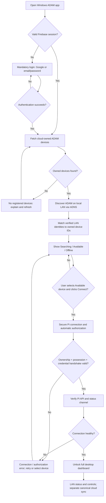
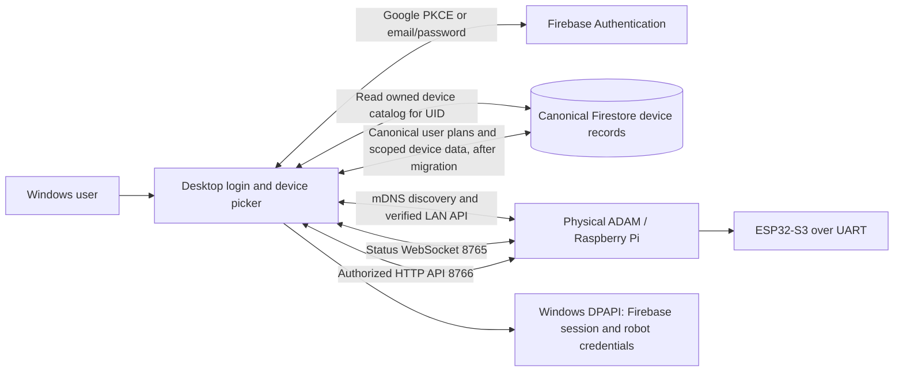

# ADAM Windows Desktop — Login-First Onboarding and LAN Connection Flow

**Status:** Approved product flow / proposed implementation; not a claim of current runtime behavior  
**Date:** 9 October 2026  
**Primary architecture reference:** [COMPANION_ARCHITECTURE_AND_DATA_FLOW.md](COMPANION_ARCHITECTURE_AND_DATA_FLOW.md)  
**Scope:** First launch, sign-in, cloud-owned device list, local discovery, automatic secure pairing, connection verification, and dashboard gating.

## 1. Product decision

The Windows desktop companion **requires account login** before proceeding. There is no guest/skip-login route in the intended desktop onboarding experience. On first launch, the app must authenticate the user, fetch the physical ADAM devices owned by that Firebase UID, discover which are reachable on the local network, and let the user select **Connect**. The app must automatically establish an authenticated local connection with the selected Pi/ADAM, including safely provisioning or retrieving the needed per-desktop credentials without asking the user to copy tokens. **Only after successful connection verification does the full dashboard open.**

This changes the desktop's current guest/account and manual-token behavior described in the primary architecture review. Do not describe this new flow as already implemented.

## 2. First-launch UX flow

1. **Launch / session check.** Display a minimal ADAM splash while restoring a securely persisted Firebase session. If no valid session exists, go directly to the login screen. Never expose the full dashboard before the connection gate is satisfied.
2. **Mandatory sign-in.** Offer **Continue with Google** and **Email + password** (including registration, reset-password, validation and useful errors). Google uses the Windows system-browser OAuth authorization-code flow with PKCE; email/password uses Firebase Auth. Both resolve to the same Firebase project `adam-ai1` and stable user `uid`.
3. **Load user's device catalog.** After authentication, query the canonical cloud-owned device records authorized for this UID. Present friendly device name and stable device identity; do not treat an app-local UUID, an unverified MAC suffix, or a simulated ADAM as proof of physical ownership. Show loading, empty, offline, and error states.
4. **Discover on LAN.** Start local mDNS/zeroconf discovery and probe eligible Pi endpoints. Match discovered identities against the user's cloud-owned device catalog. Cloud records determine **which devices belong to the user**; LAN discovery determines **which devices are currently reachable**. A cloud-owned device can be offline; an unowned discovered robot must not become connectable merely because it is nearby.
5. **Show availability.** Render each owned device with distinct states: **Searching**, **Available on this network**, **Offline / not found**, **Connecting**, **Authorization required**, **Connected**, or **Connection failed**. Offer Retry/Refresh. Never equate `lastSeen` in cloud with live LAN reachability.
6. **User clicks Connect.** Establish an authenticated local channel to the selected robot's Pi HTTP service (documented port **8766**) and status WebSocket (**8765**), using the actual discovered address. Do not rely on a fixed IP.
7. **Automatic local authorization / pairing.** The desktop and Pi must perform a secure, user-friendly authorization exchange. Generate a unique per-desktop credential or session as needed, bind it to the intended robot and account/authorized owner, store it locally using **Windows DPAPI**, and persist only the minimal verifier/authorization material on the Pi. **No manual SYNC_TOKEN copy/paste.** The protocol must prove physical authorization/possession or an already trusted pairing; Firebase login plus LAN discovery alone is insufficient to mint robot-control credentials. Exact challenge/claim and token-rotation protocol is **to be designed and implemented**, not present by implication.
8. **Verify handshake.** Check robot identity, account/ownership authorization, Pi API permissions, and successful request/response (plus telemetry channel where required). Fail closed on mismatch, expired/revoked credentials, network errors or unauthorized access. Never silently pair a different robot sharing a short ID.
9. **Open dashboard.** Only after verification, enter the complete Windows app dashboard. Start robot status, logs/diagnostics, and allowed LAN data exchanges. Account/cloud sync remains a separate state from robot pairing and must use the canonical shared Firestore contract once migrated.
10. **Subsequent launches.** Restore the Firebase session and securely stored per-device pairing, re-check cloud ownership and LAN reachability, and reconnect automatically **only when still authorized**. If unreachable, show a reconnect/device-selection screen rather than an apparently live dashboard. If signed out, return to login.

## 3. UX flow diagram

## 4. Trust and data-flow boundaries

- **Firebase UID:** identifies the signed-in person and gates cloud access. It is **not** a Pi API token.
- **Cloud ownership:** limits the device catalog and connection eligibility; require backend-enforced ownership and real physical possession verification for initial claim/transfer. Do not trust a client-editable `ownerUid` alone.
- **LAN discovery:** proves only reachability, not ownership or permission.
- **Pi authorization:** must use a distinct per-device/per-desktop secret or short-lived authorization; never ship Firebase Admin credentials to the Pi. Existing Pi `SYNC_TOKEN` and laptop-control agent token are separate security boundaries.
- **Desktop local UI session:** `X-ADAM-Session` remains separate from both Firebase and Pi authorization.
- **Canonical cloud sync:** Android already uses canonical documents, but the desktop currently writes the legacy `users/{uid}.companion` envelope. The desktop adapter must be migrated before promising cross-device convergence.
- **No direct Pi–Firestore connection:** desktop and mobile remain the authorized data bridges. Voice, camera, and real-time PC controls must not be tunneled through Firestore.

## 5. States and recovery

| Condition | User-visible result | Required behavior |
| --- | --- | --- |
| Not signed in | Login | No dashboard, no device controls |
| Authenticated, catalog loading | Finding your ADAM devices | Bounded retries and errors |
| No owned device | No registered ADAM | Explain device registration/ownership; do not fabricate an owned unit |
| Owned device, LAN not found | Offline / not on this network | Refresh discovery and explain same-network requirement |
| Device found | Available — Connect | Allow explicit selection |
| Handshake underway | Connecting securely | Timeout, cancel and safe retry |
| Possession/ownership unverified | Authorization required | No automatic trust based solely on LAN visibility |
| Identity/token mismatch | Connection failed | No dashboard; revoke/discard bad session as appropriate |
| Verified and reachable | Connected | Enter full dashboard |
| LAN drops after entry | Disconnected / reconnecting | Disable live robot controls and clearly mark stale status; reverify before resuming |
| Sign out / switch UID | Login | Clear active authorization context; fence cloud and Pi work to prior UID |

## 6. Implementation requirements / acceptance criteria

- First launch cannot bypass Firebase login; Google and email/password both work with the same Firebase UID.
- Fetch only cloud-owned, real physical devices. Device records remain visible as offline when not discovered.
- Discovery matches a **durable, collision-safe robot identity** to canonical device IDs; the current `ADAM-XXXX` MAC suffix alone is not adequate.
- One click **Connect** performs the local handshake and automatic per-desktop credential handling without manual token entry, **but only after verifiable authorization**.
- Robot and desktop secrets are never written to ordinary Firestore documents, UI responses, or logs; desktop secrets are DPAPI-protected.
- The Pi's LAN API and WebSocket channels are authenticated appropriately and errors never fall back to insecure control.
- The dashboard is unlocked only after a verified, healthy connection; reconnect requires revalidation.
- Logout, token revocation, device transfer, offline state, multiple ADAMs, duplicate short IDs, LAN failure and account switching are tested.
- Keep **signed in**, **cloud-owned**, **LAN-reachable**, **physically paired**, **authorized**, **cloud-synced**, and **applied by robot** as separate statuses.

## 7. Open protocol decisions before coding

1. Define the trusted **first-time physical possession proof** and device-claim/transfer workflow (for example, robot-displayed one-time code or physical-button confirmation); don't assume cloud ownership alone suffices.
2. Specify durable robot identity, discovery-to-cloud matching and duplicate/legacy-ID migration.
3. Define per-desktop token creation, scopes, lifetime, rotation, revocation, and Pi-side verification, including recovery after reinstall.
4. Define dashboard behavior for transient disconnects and whether any read-only cached view is accessible before reconnection (the default in this spec is **no full dashboard**).
5. Implement and verify the desktop canonical Firestore migration described in the primary architecture review; onboarding alone does not resolve the existing Android/desktop sync mismatch.

**Relationship to main architecture document:** This file records the requested future desktop user journey and connection gate. [COMPANION_ARCHITECTURE_AND_DATA_FLOW.md](COMPANION_ARCHITECTURE_AND_DATA_FLOW.md) remains the source of truth for audited **current behavior** and the broader planned data architecture until implementation and a coordinated documentation update.
